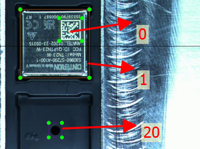
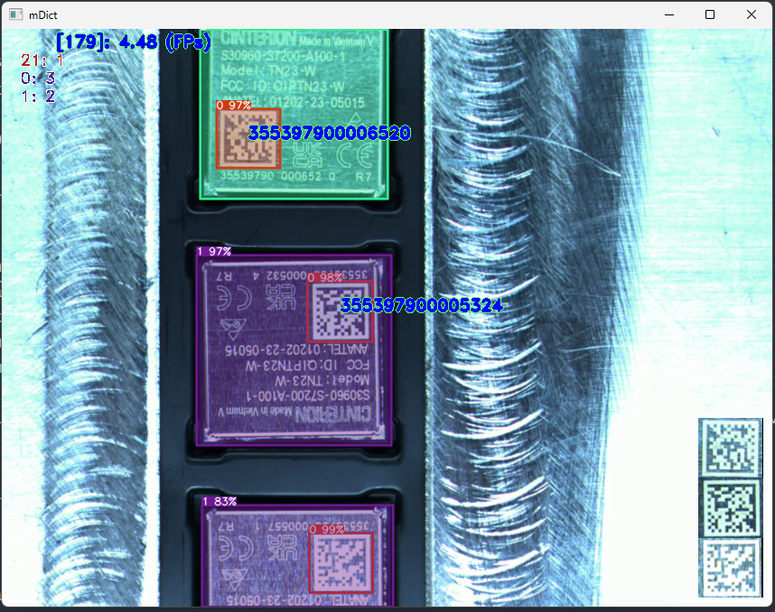

# Phát triển Telit Tapping

Model name: `Tapping` (bắt buộc, trong `All_Models`)

## Thống nhất nhãn:

- 0: nhãn mã dtmx
- 1: 1_Eagle
- 2: 2_Ginger1
- 3: 3_Jakata_EHS6
- 4: 4_Serval_thuan
- 5: 5_Viper

Từ nhãn 20 trở đi, là các nhãn NG:

- 20: Nhãn cái lỗ
- 21: Nhãn 1_Eagle ngược chiều

## Nguyên tắc đánh nhãn:

- Mỗi Model (loại chip khác nhau) sẽ được lưu trong một folder khác nhau, có đánh stt cho model đó
- Khi nào **nhìn hết được** mã dtmx thì coi như cả chip đó được nhìn rõ, khoanh cả vỏ lẫn dtmx.
- Trong khi đánh nhãn = Foxlabel:
    - Dùng phím 1: Tạo nhãn mới (Create RectBox)
    - Dùng phím 2: Sửa kích thước, di chuyển vị trí (Edit RectBox)
    - Dùng phím 3: Nhân bản nhãn đang chọn (Duplicate RectBox)
    - Dùng phím a, d: di chuyển trước sau
    - Dùng phím s: Save
    - Dùng phím f: Paste toàn bộ nhãn đã lưu lần cuối vào
    - Dùng phím z: Delete RectBox
    - Kinh nghiệm:
        - Khi vẽ mới hoặc nhân bản RectBox, nếu vị trí đè lên nhau, thì cần làm cái to, ngoài trước, trong, bé sau

## 01_Eagle

Đánh nhãn:



# Newest Dev



# Tapping requirements

# Đây là các bước phát triển phần mềm Tapping (tóm tắt):

1. Phân tích yêu cầu và thiết kế hệ thống (3 ngày)

2. Phát triển các module chính:

- Phát hiện và nhận dạng chip (3 ngày)
- Đọc mã dữ liệu song song (3 ngày)
- Xử lý các lỗi (thiếu dữ liệu, ngược chiều, sót dữ liệu, nhầm dữ liệu, không đọc được mã) (20 ngày)
- Giao diện và hiển thị thông tin (2 ngày)
- Lưu trữ và truy xuất dữ liệu (2 ngày)
- Tích hợp với hệ thống IVIS (3 ngày)

3. Kiểm thử và hiệu chỉnh (9 ngày)

4. Thu thập và gán nhãn dữ liệu (10 ngày)

5. Tối ưu hóa hiệu năng hệ thổng (3 ngày)

Tổng cộng có 19 mục công việc (TODOs). Trong đó tập trung vào xử lý các lỗi, thu thập dữ liệu và kiểm thử.

# Đây là chi tiết hơn về các công việc cần làm cho dự án Tapping:

1. Phân tích yêu cầu và thiết kế hệ thống

    - Xác định yêu cầu chức năng và phi chức năng
    - Thiết kế kiến trúc hệ thống và các module
    - Thiết kế cơ sở dữ liệu
    - Thiết kế giao diện người dùng

   **Chi tiết:**
    1. Xác định yêu cầu chức năng và phi chức năng
        - Xác định các chức năng chính:
            + Quét mã tray
            + Bấm start cho chạy
            + Nhận dạng chip đúng, đọc mã DTMX gửi lên SFIS, cập nhật kết quả, hiển thị
            + Nếu lỗi thì cho dừng chuyền, chờ công nhân xử lý, sau khi xử lý thì công nhân bấm chạy tiếp
            + Hết 500 con liệu thì có báo cáo tổng kết
        - phát hiện và nhận dạng chip: label gồm có các loại chip sau: [...]
        - đọc mã dữ liệu: Mã datamatrix code
        - xử lý lỗi:
            + *Thiếu dữ liệu*: trên tray bị thiếu một số chip, không đúng như yêu cầu là mỗi ô phải có một chip.
            + *Ngược chiều*: chip xoay ngược chiều so với SOP, ngược chiều so với các con chip còn lại
            + *Sót dữ liệu*: hệ thống bỏ qua một số chip, không đọc được mã dữ liệu
            + *Nhầm dữ liệu*: hệ thống đọc liệu nhưng liệu này không có trong danh sách cần làm
            + *Không đọc được mã*: phát hiện thấy chip nhưng không đọc được mã trên đó
            + *Lỗi phần cứng*: lỗi camera, đèn,... dẫn tới không nhận diện được chip hoặc không đọc được mã.
        - Hiển thị thông tin:
            + Mã tray
            + Danh sách các liệu đã xử lý trên tray đó
            + Danh sách các liệu bị lỗi
            + Số lượng chip trên một tray đã xử lý
            + Ảnh hiện tại (hiển thị trên giao diện)
            + Toàn bộ ảnh lịch sử của từng con chip (đã được cắt lẻ để giảm dung lượng)
        - lưu trữ dữ liệu:
            + Số lượng Tray đã từng chạy theo ngày tháng năm, OK,NG
            + Trong đó, lưu danh sách các Tray đã chạy
            + Trong 1 Tray: mỗi dòng là thông tin: Thời gian, mã chip, thuận ngược
            + Dữ liệu kết quả để báo cáo, truy vấn
            + Dữ liệu debug chương trình
            +
        - Xác định yêu cầu phi chức năng: hiệu năng, tốc độ xử lý, khả năng mở rộng, tính bảo mật,...
            * Hệ thống có thể xử lý 500 chip trong 20-25 phút (tốc độ chuyền đang chạy hiện tại)
                - 1 Tray có 500 chip
                - Thời gian xử lý 1 Tray là 20-25 phút
                - Suy ra:
                    - Thời gian xử lý trung bình cho 1 Tray 500 chip là:
                        - Thời gian ngắn nhất: 20 * 60 = 1200 giây
                        - Thời gian dài nhất: 25 * 60 = 1500 giây
                    - Vậy thời gian xử lý trung bình cho 1 chip là:
                        - Ở thời gian ngắn nhất: 1200/500 = 2.4 giây
                        - Ở thời gian dài nhất: 1500/500 = 3 giây
                - Như vậy, thời gian xử lý trung bình cho mỗi chip nằm trong khoảng 2.4 - 3 giây.
            * Thời gian phản hồi (response time) của hệ thống không quá 500ms (Test trên máy tính i9-9900K)

2. Thu thập và gán nhãn dữ liệu

    - Liệt kê toàn bộ các nhãn có thể có hiện tại và tương lai cần dùng. Dự kiến:
        * 0: nhãn mã dtmx
        * 1: 1_Eagle
        * 2: 2_Ginger1
        * 3: 3_Jakata_EHS6
        * 4: 4_Serval_thuan
        * 5: 5_Viper
        * 6: ???
        * 7:
        * Từ nhãn 20 trở đi, là các nhãn NG
        * 20: Nhãn cái lỗ
    - Xây dựng tập dữ liệu đầy đủ các trường hợp:
        + Tất cả các trường hợp **OK** của các nhãn, thay đổi nhưng sao cho vẫn đảm bảo OK
            * Thay đổi vị trí chip (lệch vị, xộc xệch)
            * Thay đổi tốc độ chậm rồi nhanh dần (cái này chỉ lấy để làm video test, tuy nhiên cần cũng nhiều tốc độ khác nhau)
            * Thay đổi ánh sáng:
                - Thay đổi màu sắc đèn
                - Thay đổi hướng của đèn
                - Thay đổi ánh sáng môi trường
                - Thay đổi cường độ sáng
            * Thay đổi góc của camera
                - Lấy đường vuông góc với mặt phẳng chip làm chuẩn, lấy video có các góc xoay quanh góc này
            * Thay đổi độ phân giải
                - Chỉ cần đảm bảo là mỗi điểm/vạch/cạnh đen/trắng của mã dtmx có tối thiểu 4px là được, tất cả các độ phân giải đều cần lấy data
            * Thay đổi chiều cao của cam so với chip
                - Mỗi góc của chip cần 1 chiều cam tương ứng
            * Thay đổi camera
            * Thay đổi lens, góc rộng, góc hẹp
        + Tất cả các trường hợp **NG** có thể xảy ra
            * Liệt kê những trường hợp đã từng xảy ra
                - Thiếu liệu,
                - Ngược chiều (chip bị xoay các góc khác nhau),
                - Sót liệu (lỗi của ctrinh),
                - Nhầm liệu (IVIS đọc bth: SFIS bảo NG),
                - Lỗi detect ra chip nhưng không đọc được mã dtmx
                - Dupplicate SN (chương trình tự phát hiện, SFIS cũng sẽ phát hiện ra và cảnh báo)
            * Phán đoán các trường hợp có thể xảy ra trong tương lai, do chương trình, do cách thao tác, do SFIS, do quy định thay đổi,...
                - Công nhân thao tác không đúng SOP
                - Sảo mã xong không đặt chip đúng nơi quy định (cái này có thể ngoài phạm vi của cam nên IVIS không biết)
                - Bấm nút liên tục trong khi chương trình đang xử lý chưa xong (có thể mất file config)
                -
            * Các trường hợp NG do môi trường thay đổi, phần cứng, phần mềm
                - thay camera
                - đổi góc cam
                - đổi lens, sai tiêu cự, sai khẩu độ
                - thay đổi ánh sáng: thay đèn, thay vị trí đèn, thay nguồn điện của đèn, thay độ sáng của đèn,...
                - tốc độ chuyền: quá nhanh hoặc quá chậm, ngoài phạm vi cho phép
                - thay đổi máy tính: không cài đúng, đủ được các phần mềm, driver yêu cầu, không đủ tốc độ xử lý
                - thay đổi phần mềm giao tiếp (vd: phần mềm giao tiếp SFIS, COM ảo)
                - Thiết bị ngoại vi: không bật/tắt được thiết bị ngoại vi (đèn, chuyền)
                -
            * Các trường hợp do cấu hình sai
                - Cấu hình sai => bị lỗi, chạy sai hoặc không chạy được:
                    + Sai cấu hình hệ thống
                    + Sai trong file config
                - Cấu hình sai: không tiện
                    + Sai ảnh đại diện
                    + Sai tên model
                    + Sai CFT
                    + Sai tên cam
                    + Sai vị trí máy
                    + ...
    - Gán nhãn chính xác cho dữ liệu
    - Chú ý: dữ liệu cần đa dạng và phong phú

3. Tốc độ xử lý
    - Tốc độ nhận dạng 1 chip: 200-285 ms (với tốc độ hiện tại 4-5.6 FPS)
    - Tốc độ đọc mã trên 1 chip dưới 150ms (Test trên máy tính i9-9900K)
    - Tốc độ xử lý 1 lỗi dưới 5 giây

4. Khả năng mở rộng
    - Hỗ trợ mở rộng thêm các loại chip mới mà không ảnh hưởng tới các chức năng hiện tại
    - Nếu sau này có thêm chip thì chỉ cần lấy data để huấn luyện lại mô hình là được. Giải pháp xử lý vẫn giữ nguyên
    - Có khả năng mở rộng thêm model mới có cùng tính năng
    - Nếu thay đổi phần cứng thì phải cấu hình ánh sáng, độ nét, tỷ lệ chip/ảnh, cho đúng với ban đầu. Nếu không đúng, cần lấy lại data để train lại.

5. Log
    - Ghi lại log của tất cả các trạng thái của hệ thống mỗi lần xử lý và đưa ra kết luận

6. Phát triển module phát hiện và nhận dạng chip

    - Nghiên cứu các thuật toán phát hiện và nhận dạng ảnh
    - Xây dựng mô hình nhận dạng chip
    - Tích hợp mô hình vào hệ thống
    - Tích hợp với phần cứng (camera, đèn flash,...)
    - Chú ý: cần xử lý các trường hợp phát hiện sai

7. Phát triển module đọc mã dữ liệu

    - Nghiên cứu các thuật toán đọc mã vạch/mã QR
    - Xây dựng chức năng đọc mã song song
    - Tích hợp với phần cứng (camera, đèn flash,...)
    - Chú ý: tốc độ đọc, độ chính xác

8. Xây dựng sub-AI model (dùng machine learning):
    - (OK) AI để tự động học hành vi, học các vị trí thuận lợi nhất để tự động cải thiện tốc độ xử lý:
        + Tự động phát hiện vị trí lần đầu đọc dc chip => lưu vào data => tự train.
        + Mỗi lần detect dc chip thì kiểm tra vị trí, nếu trong vùng này thì đọc mã dtmx, không thì thôi, đã đọc dc chip rồi thì cũng thôi khỏi cần đọc lại
    - AI tự động nhận định môi trường có đang đúng với điều kiện có thể vận hành hay không, không thì cảnh báo, tự học
    - (OK) AI tự học số lượng chip trên một frame. Nếu có bất thường: báo lỗi che khuất.
    - (OK) Học kích thước chip và kích thước DTMX, để xét xem có đúng là `Chip Without DTMX` không?

9. Xử lý các lỗi

    - (OK) Xây dựng cơ chế phát hiện và xử lý từng loại lỗi
    - Ghi lại log để phân tích nguyên nhân lỗi
    - (OK) Chú ý: mỗi lỗi cần xử lý khác nhau, tránh ảnh hưởng tới tốc độ xử lý
    - Các lỗi có thể gặp trong hệ thống:
        + (OK) Thiếu liệu,
        + (OK) Ngược chiều,
        + (OK) Sót liệu (lỗi của ctrinh),
        + (OK) Lỗi detect ra chip nhưng không đọc được mã
        + Nhầm liệu (IVIS đọc bth: SFIS bảo NG),
        + Dupplicate SN (chương trình tự phát hiện, SFIS cũng sẽ phát hiện ra và cảnh báo)
    - (OK) Chuyền vẫn chạy, nhưng bị che hết CAM:
        - Mỗi lần xly 1 frame => gửi 1 lệnh xuống phần cứng để xóa timer
        - Nếu quá t(ms) mà phần cứng không nhận được thông tin từ PM => dừng chuyền
        -
    - (OK) Partially_Covered_Camera: nếu đang chạy bth, 1 vài vị trí nào đó bị che lấp:
        - PM tự học số lượng chip/frame
        - Học khoảng cách các chip
        - nếu thiếu => tìm vị trí thiếu => dừng chuyền
    - Xử lý trùng SN
        - Khi 1 SN đã được chạy rồi, PASS rồi, xong bị kéo lùi lại thì xử lý thế nào?
        - => OP xác nhận là tray đã bị kéo lùi lại,
        - => Đọc được SN mới, dò lại từ đầu đến khi gặp SN đó
        - => Xác nhận là cập nhật thông tin trạng thái CHIP nhưng không gửi lên SFIS
        - => Khi nào gặp chip mới chưa gửi lên SFIS thì mới gửi đi
        - => over 3 times: stop, need TE engineer
10. Giao diện và hiển thị thông tin

    - Thiết kế giao diện trực quan, dễ sử dụng
    - Hiển thị các thông tin cần thiết như mã đọc được, tốc độ, số lượng,...
    - Cho phép người dùng tương tác để xử lý sự cố

11. Lưu trữ và truy xuất dữ liệu

    - Thiết kế cơ sở dữ liệu để lưu trữ các thông tin
    - Xây dựng chức năng tra cứu và truy xuất dữ liệu
    - Chú ý: tối ưu hiệu năng truy xuất và lưu trữ

12. Tích hợp với hệ thống IVIS

    - Xác định giao thức tích hợp với IVIS
    - Phát triển chức năng gửi/nhận dữ liệu từ IVIS
    - Kiểm tra tích hợp và xử lý lỗi

13. Kiểm thử và hiệu chỉnh

    - Kiểm thử các tính năng, giao diện và tích hợp
    - Hiệu chỉnh các lỗi và vấn đề phát sinh
    - Chú ý: cần kiểm thử kỹ các trường hợp biên

14. Tối ưu hóa hiệu năng

    - Phân tích và tối ưu hóa thuật toán
    - Tối ưu hóa cơ sở dữ liệu và truy xuất
    - Chú ý: đảm bảo tốc độ xử lý

---

# Manual Analysis Tapping Telit Project:

Tapping:

1. Khảo sát
    - Khảo sát thực tế
    - Tìm hiểu yêu cầu, phân tích bài toán
    - Họp khảo sát yêu cầu với khách hàng
    - 0.5 day (100% )
2. Lập kế hoạch phát triển
    - lên phương án, lập kế hoạch phát triển phần mềm
    - 0.5 day (100%)
3. Phát hiện chip, vẽ lên ảnh
    - 3 days (100%)
4. Đọc mã dtmx song song
    - 3 days (100%)
5. Lỗi: thiếu liệu, ngược chiều, sót liệu (lỗi của ctrinh), nhầm liệu (IVIS đọc bth: SFIS bảo NG),
   Lỗi detect ra chip nhưng không đọc được mã
6. Có 10 loại chip khác nhau
    - ??? time: data 10 chip thì lấy bao lâu? hay là chỉ lấy cho chip đang chạy
    -
7. Setup phần cứng: yêu cầu có tối thiểu 3 đèn có thể điều khiển (bật tắt) tốc độ cao
    - ??? bao lâu xong
    -
8. Các bước xly khi lỗi: thiếu liệu:
    - dừng chuyền, báo NG => công nhân ấn prosess => chạy tiếp
    - 3 days (100%)
    -
9. Xử lý ngược chiều:
    - dừng chuyền, báo NG =>  công nhân ấn prosess => chạy tiếp
    - 5 days (100%)
10. Chip_without_DTMX: Lỗi detect ra chip nhưng không đọc được mã (hoặc không có mã): OK
    - Dừng chuyền
    - Báo xót liệu => Xly theo chu trình xót liệu
    - 3 days (100%)
    -
11. Chuyền vẫn chạy, nhưng bị che  (hết hoặc 1 phần) CAM: ...
    - Kiểm soát theo số lượng chip đọc được theo trung bình vẫn đọc
    - 3 days (100%)
12. Các tính năng bổ sung: OK
    - Phát hiện tốc độ chuyền
    - Phát hiện ánh sáng bất thường
    - Phát hiện độ nét của CAM
    - 3 days  (100%)
13. Truyền thông SFIS:
    - Truyền thông mã Tray: chỉ gửi lên SFIS 1 lần, lần đầu tiên khi bắt đầu chạy chuyền.
    - (100%)

14. Xử lý trùng SN
    - Thuật toán thứ 1:
        - Mỗi khi update mDict, kiểm tra xem SN đó có trong set lưu SN duy nhất hay chưa?
            - Nếu chưa:
                - Thêm SN, idTracker vào tập của nó
            - Nếu rồi, kiểm tra xem idtracker có trong tập của nó chưa?
                - nếu chưa:
                    - Xác lập lỗi trùng SN
                    - Vẽ vạch chéo lên ảnh.
    - Thuật toán thứ 2:
        - Nếu trong HCN (hình chữ nhật) Vàng => mKey=0
        - Nếu Ngoài HCN vàng => mKey+=1
            - Nếu mKey == 1: Xét Dupplicate
            - (phương pháp này đã làm, nhưng hiệu quả không cao bằng pp 1, nên tạm thời không dùng, vì khi detect dc thì đã gần hết chu trình, khó thay thế chip khác vào.)
    - Cách 1:
        - Khi 1 SN đã được chạy rồi, PASS rồi, xong bị kéo lùi lại thì xử lý thế nào?
        - => OP xác nhận là tray đã bị kéo lùi lại,
        - => Đọc được SN mới, dò lại từ đầu đến khi gặp SN đó
        - => Xác nhận là cập nhật thông tin trạng thái CHIP nhưng không gửi lên SFIS
        - => Khi nào gặp chip mới chưa gửi lên SFIS thì mới gửi đi
    - Cách 2:
        - Cứ gặp lỗi thì chỉ được phép kéo đúng con lỗi lùi lại thôi, kéo quá thì bị căn, dừng, chờ kỹ sư xử lý
            - Kỹ sư: nhập Pass, cho phép mã trùng do kéo lùi chạy tiếp (nếu đã từng gửi lên SFIS thì bỏ qua, chưa gửi thì gửi lên),
            - Khi qua đoạn đã kéo rồi, thì bỏ chế độ kỹ sư đi để chạy bình thường.
    - Đã thảo luận với User, lỗi thì dừng chuyền
    - 5 days (100%)
    -
15. Nhầm liệu (IVIS đọc bth: SFIS bảo NG): OK
    - dừng chuyền
    - xly như thiếu liệu.
    - 2 days (100%)
    -
16. Lưu log của tất cả các bước xử lý
    - 2 days (100%)
17. Lưu database
    - 1 days (100%)
    - Các thông tin sẽ lưu:
        - sdDatetime = 'DateTime'
        - sd_Tray_MAC = 'Tray MAC'
        - sd_Chip_Label = 'Chip Label'
        - sd_sttChip = 'Chip Order'
        - sd_TotalChip = 'Total Chip'
        - firstSN_Arrived = 'First Time SN Arrived'
        - sd_Current_Status = 'Current Status'
        - sd_Current_Errors = 'Current Errors'
        - sdmessage = 'Message on Image'
        - sdinImg_shape = 'Image shape'
        - sdImagePath = 'Image Saved To'
        - sdDev = 'Dev ID'
        - sdSysName = 'System Name'
        - sdStation = 'Station Name'
        - sdData_Send2SFIS = 'Data Send 2SFIS'
        - sdSFIS_feedback = 'SFIS Feedback'
        - sddebug = 'is Debug'
        - sdStartRunningTime = 'Passing Time'
        - sdDTMX_Code_Length = 'DTMX_Code_Length'
        - sdROI_NumberOf_Chip_or_DTMX_min_max = 'ROI_NumberOf_Chip_or_DTMX_min_max'
        - sdROI_Cover = 'ROI_Cover'
        - sdTextXY = 'TextXY'
        - sdWDT_MAX = 'WDT_MAX'
        - sdLAMPs = 'LAMPs'
    -
18. Lưu ảnh theo database
    - Lưu ảnh khi có nhãn mới xuất hiện hoặc có lỗi nào đó cần phải dừng chuyền (firstSN_Arrived or NeedStop)
    -
19. Tích hợp Ivis
    - 3 days (45%)
    -
20. IVIS: Hiển thị: Mã SN đọc được của mỗi chip, Mã MAC của Tray
    - 0.5 day (100%): xly tác vụ: không chạy khi quét mã Tray, lần đầu tiên, chưa chạy, lưu vào mã Tray, xoá ô nhập, hiển thị lên ảnh
21. IVIS: Hiển thị tổng số sn đã chạy qua, tổng số cuộn đã từng chạy, danh sách các SN đã và đang chạy
    - 0.5 day (100%): xử lý lưu trữ thông tin
    - 
22. Xử lý OK/NG label theo data quy hoạch thực tế:
    - OD_OK_Labels
    - OD_ErrorLabels
    -
23. Lấy data:
    - 7 days (60%)
24. Lấy đánh nhãn data:
    - 3 days (60%)
25. Huấn luyện lại mô hình:
    - 2 days (0%)
    - ------------------------ Bên dưới là chưa xong ------------------------------------
26. Hiệu chỉnh phần cứng
    - 3 days (0%)
27. Xly lỗi Sót liệu:
    - Phần mềm bị mất kiểm soát => dừng chuyền
    - Mỗi lần xly 1 frame => gửi 1 lệnh xuống phần cứng để xóa timer
    - Nếu quá t(ms) mà phần cứng không nhận được thông tin từ PM => dừng chuyền
    - 6 days (80%), còn lại phần cứng chưa nạp được chương trình.
28. Test nội bộ 3 lần
    - 3 days (0%)
29. Total ~ 0.5 + 0.5 + 3 + 3 + 3 + 5 + 3 + 3 + 3 + 5 + 2 + 2 + 1 + 6 + 3 + 0.5 + 0.5 + 7 + 3 + 3 + 2 + 3 = 62 days (làm liên tục, hạn chế làm việc khác)
30. TODO:
    - Gửi TraySN  lên SFIS, nhận lại tên model + Số lượng chíp trong 1 tray
    - Từ tên model đó => chọn config cho nó
    - (Done) Nếu begin of tray thì không check lỗi
    - (Done) Nếu isEndOfTray thì không update tiếp, không check lỗi. 


## Video minh họa:

1. (CreateTime = 8/21/2023 -- 5:49 PM): https://drive.google.com/file/d/1oBir_bnjd5z1aNUsc-Z1wb9BZ1Mwa8PG/view?usp=sharing
2. (nt.anh.fai@gmail.com (8/31/2023 -- 1:56 PM)): https://drive.google.com/file/d/1JGlHgSNJYVCwULAjrG7RpONGLsl8QPhO/preview

# Một vài thư viện hay liên quan:

## FPS:

```python
from imutils.video import FPS

fps = FPS().start()
...
fps.update()
fps.stop()
...
s = f" {fps.fps():.2f} (FPs)"

```

# Tracking:

- Ban đầu chưa có gì
- Khi nhận được mDict (trạng thái predict của frame đang xly)
- Nếu đã có mã DTMX, thì loại bỏ ảnh ROI DTMX => cập nhật mã DTMX vào 1 danh sách (có thể là imROIs)
- Nếu chưa có mã DTMX: giữ lại => pha sau sẽ đọc DTMX của ảnh này
- Đọc xong cập nhật lại mDict

# Giao thức truyền nhận với SFIS:

1. Format xác nhận yêu cầu gửi lên IT :
    - AI - IT :  "V1013922{Spaces:7}EMPEND"
        + V1013922 : Là mã thẻ của người phát triển chương trình. Theo yêu cầu của IT thì nếu thay đổi mã thẻ trên thì phải gửi yêu cầu cho IT để họ xác nhận.
    - IT - AI : Chuỗi AI gửi lên kèm theo "PASS" or "ERRO"
    - Format này theo yêu cầu của IT . Hiện tại trước khi đóng 1 tray hàng thì cần gửi chuỗi này lên để IT xác nhận.
2. Format gửi giá trị SN (mã Dtmx):
    - AI - IT : "{TRAY:12}{Spaces:3}{SN:15}TRAYMACEND\r\n"
        + TRAY : Đây là mã của 1 Tray. 1 Tray sẽ bao gồm các con hàng cần đóng.
        + SN : Đây là mã SN của 1 con hàng.
    - IT - AI : chuỗi AI gửi lên kèm theo "PASS" or "ERRO"
    - VD :
        + AI - IT : 111111111111 355649260042150TRAYMACEND
        + IT - AI : 111111111111 355649260042150PASS
3. Format reset tray:
    - AI - IT : "{TRAY:12}{Spaces:3}RESETTRAYEND\r\n"
    - IT - AI : Chuỗi AI gửi lên kèm theo "PASS" or "ERRO"
    - Bắt đầu đóng 1 Tray mới
    - Chức năng này dùng để reset lại 1 tray trong trường hợp đang đóng dở 1 tray mà muốn đóng lại từ đầu.
    - Lấy thông tin Tray lần đầu chạy, hoặc làm lại Tray đó từ đầu:
      - AI => IT: `"{TRAY:12}{Spaces:3}RESETTRAYEND\r\n"`
      - IT => AI: `"{TRAY:12}{Spaces:3}RESETTRAYEND##ModelName#Quantity#PASS\r\n"`
      - Ví dụ:
        - AI => IT: `"TrayMAC12345          RESETTRAYEND\r\n" `    
        - IT = >AI: `"TrayMAC12345          RESETTRAYEND#ModelName#Quantity#PASS\r\n"  // ModelName, Quantity & PASS`

4. Mong muốn của AI:
    - Để thông tin tường minh, thì nên dùng thư viện này truyền nhận:
    - mStr = json.dumps(mDic)
    - mDic = json.loads(mStr)
    - Ví dụ:
      ```
       mStr = '{"TrayMac": "MAC12345", "Key": "RESETTRAY", "ModelName": "123", "Quantity": "500"}' // Đây là 1 xâu json, cấu trúc là 1 dict
       mDic = {'Key': 'RESETTRAY', 'ModelName': '123', 'Quantity': '500', 'TrayMac': 'MAC12345'}   // Đây là 1 dict
      ```


# Giao thức giao tiếp với Hardware:

- `{cnt}` là biến đếm số có thể lên đến 10 chữ số và dấu trừ, ví dụ: loại `DDMM-HHMMSS`, dữ liệu gửi đi `0825-102531`, tăng dần, cái này không quan trọng, chỉ cần kiểm tra có xâu sau nó trong truyền thông thì thực hiện lệnh.
    - Ưu điểm của cách này, là khi lưu log, sẽ biết chính xác thời gian gửi lệnh nào đi.
- `RUN\n`: chạy chuyền, ví dụ: `12.RUN\n`, `0825-102531.RUN\n`
- `STOP\n`: dừng chuyền , ví dụ: `16.STOP\n`, `0825-102538.STOP\n`
- `LAMP:XYZT\n`: thay đổi trạng thái 4 đèn X, Y, Z, T = 0/1: 0: tắt đèn, 1: bật đèn. Ví dụ khi format xâu:  `LAMP:0110\n`, khi Hardware nhận được: `18.LAMP:0110\n`
- `WDT:N\n`: Thời gian max = N, Khi biến `wdt_cnt>=N` thì tự động dừng chuyền. Ví dụ: `33.WDT:135\n`
- `CLEAR_WDT\n`: Xóa bộ đếm tăng wdt_cnt: `wdt_cnt=0`. Ví dụ: `0825-112533.CLEAR_WDT\n`
- `NG\n`: Có lỗi xảy ra, báo còi đèn. Ví dụ: `777.NG\n`
- `OK\n`: đã xử lý xong lỗi, tắt còi đèn đi. Ví dụ: `7576.OK\n`
-

# What is news:

## Tapping V0.3
- Start date: nt.anh.fai@gmail.com (9/23/2023 -- 4:15 PM)
- Tích hợp Yolo5ONNX model vào hệ thống Tapping
- Đo lường thời gian chạy từng thành phần trong mô hình
- Huấn luyện Yolo8 model cho 4 lớp, đa bảo chạy được tất cả các model (hiện tại có đến 88 models, và trong tương lai còn có thể nhận dạng thêm)
  - Tốc độ chạy toàn bộ hệ thống ~12FPs (predict mất ~50 ms)
- Huấn luyện mô hình Yolo5 cho 4 lớp, so sánh tốc độ chạy
  - Tốc độ chạy toàn bộ hệ thống: ~ 6 FPS (predict mất ~120ms)
- Chuẩn hóa lại truyền thông nối tiếp giữa phần mềm với SFIS. và phần cứng
  - Phần mềm tuân thủ theo format cũ (viết format mới rồi nhưng họ yêu cầu thay đổi thì cần chạy đơn. Không biết sau khi chạy đơn xong thì bao lâu, có ảnh hưởng đến cái cũ không, nên lại thôi)
  - Phần cứng không còn, nên họ cũng yêu cầu chạy theo phần cứng cũ.
 
- 
## Tapping V0.2

- Start date: nt.anh.fai@gmail.com (8/28/2023 -- 4:15 PM)
- Thêm idTrack vào mDict để dễ dàng so sánh mã trùng lặp
- Thêm: Hoàn thiện chức năng handle_Duplicate_SN
- Thêm: Hoàn thiện module truyền thông phần cứng
- Thêm: Hoàn thiện class truyền thông SFIS
- Thêm: Hoàn thiện chức năng gửi mã Tray, mã Dev code lên SFIS
- Thêm: Đã làm xong phần giao tiếp với phần cứng, mỗi model một bộ giá trị riêng, có thể giống nhau hoặc khác nhau. Mỗi chức năng là 1 hàm, giá trị của nó được cấu hình trong file config, nếu không có trong file config hoặc đã bị xóa thì tạo lại mặc
  định:
    - COM_CLEAR_WDT(): Xóa bộ đếm watchdog
    - COM_Siren_NG(): bật còi, đèn cảnh báo
    - COM_CMD_RUN(): chạy chuyền
    - COM_Turn_LAMP(): bật đèn tương ứng
    - COM_WDT_MAX(): Gửi giá trị watchdog tối đa
    - COM_CMD_STOP(): Dừng chuyền
    - COM_Siren_OK(): Tắt còi đèn
- Fixbugs:
    - Fail reading DTMX: loại bỏ lỗi dtmx thiếu 1 phần ngoài vùng nhìn thấy của camera.
        - trước cứ đọc, ngoài vùng vàng thì báo lỗi
        - sau: kiểm tra xong mã DTMX có vuông không, nếu vuông thì đọc, cho phép sai số 15%
- Firmware:
    - Code: "D:\Code\Embedded_System\Tapping_Firmware1\DUY_Telit\TeLit1\Tapping_Hardware.hex"
    - Mô phỏng: "D:\Code\Embedded_System\Tapping_Firmware1\Tapping-v1.pdsprj"

## Tapping V0.1

- Release date: 8/17/2023 -- 5:21 PM
- Code chương trình chính: giả lập IVIS
    - Khởi tạo class Tapping
    - giả lập gọi nhập MAC để lấy mã Tray
    - Nếu mã Tray OK: chạy tiếp, chạy chương trình chính
    - Trong quá trình chạy chương trình chính: gọi Scan Mac trước, kiểm tra xem có Scan không.
- ChipDetection: Detect chip, các việc liên quan đến dự đoán chip và các thông tin liên quan
    - kết quả trả về:
        - `mDict = {
          'scores': scores,
          'input_image': combined_img,
          'BoxesNames': class_ids,
          'boxRectangle': [[clsID, list(box)] for clsID, box in zip(class_ids, mBoxes)],
          'boxRectArea': [[stt, clsID, list(box), CalArea(box)] for stt, [clsID, box] in enumerate(zip(class_ids, mBoxes))],
          }`
- BarcodeReader: Đọc mã DTMX, trả về một danh sách mã nếu đọc được, nếu không đọc được thì trả về mã rỗng
    - liên quan: hàm process_roi sẽ đọc mã và xử lý thông tin liên quan
        - Kết quả trả về: `[stt, pc, sn_list]`
- Status_Keeper: lưu trữ mọi thông tin liên quan đến hệ thống (hiện tại cái này chưa dùng)
- Tray_Run_Stop: lớp này là lớp ra lệnh cho phần cứng chạy, dừng, theo dõi thời gian chạy, thời gian dừng.
- DataHandler: Quản lý mọi lỗi của hệ thống.
    - Reset_variables: Xóa biến chu kỳ mỗi frame, các biến sau mỗi một lần predict xong, xử lý xong sẽ bị xóa.
    - update: cập nhật trạng thái của biến dự đoán ngay sau khi có dữ liệu đầy đủ: OD + DTMX
    - handle_missing_data: Xử lý lỗi thiếu liệu (xuất hiện nhãn 20), kiểm tra và quyết định tiếp tục chuyền hay không
    - handle_reverse_direction: Xử lý lỗi khi phát hiện chip bị quay ngược chiều
    - handle_wrong_material: Lẫn con liệu khác vào đây (đây không phải là loại chip đang chạy), phát hiện ngay từ lúc detect chip.
    - handle_wrong_SN: Hàm này sẽ được gọi sau khi SFIS trả về kết quả. Nếu SFIS trả về NG thì báo lỗi
    - handle_failed_reading:
        - Xử lý lỗi không đọc được mã từ hàm detect_chip(),
        - Trả về True nếu có chip nhưng read_dtmx không trả lại kết quả,
        - Hàm này chỉ xử lý khi ROI0 ngoài vùng cần phải đọc được (vượt qua vùng ROI "COVER") mà vẫn không detect được
    - handle_Chip_without_DTMX:
    - handle_is_Covered_Camera:
    - clear_hardware_watchdog:
    - SaveData(self, predictImage, firstSN_Arrived):
    - detect_speed:
    - should_stop:
    - runTray:
- ImageProcessing:
- Init_Video_Camera:
- Tracking:
- SerialCommunication:
- TappingMain:
- Tối ưu tất cả các thư viện, tăng tốc độ xử lý từ 5-6 FPS lên 7-12 FPS
- Thêm tính năng loại bỏ ROI DTMX trùng nhau từ 50% ngay từ khi Detect chip. Lý do là không thể có chuyện DTMX trùng nhau, chồng chép lên nhau. Cái này xử lý trong predict PostProcess
- Cải thiện tốc độ xử lý chồng chéo ROI DTMX
- Thay đổi thuật toán tính FPS cho chính xác, kế thừa từ phương pháp của `from imutils.video import FPS`, dùng thư viện `time.time()` thay vì `datetime` (kết quả không chính xác khi reset số lượng frame)
- Fixbugs: thay đổi thuật toán tính SN Speed, không dùng list dài nữa, mà chỉ dùng list thời gian của 50 lần cuối cùng thôi, tốc độ xử lý sẽ nhanh hơn
- Fixbugs: Thay đổi thuật toán kiểm tra xem có 1 mã SN mới được thêm vào hay không, bằng cách dùng dict độ phức tạp O(1) thay cho list có độ phức tạp O(n)
- Dev:
    - Thêm tham số đọc video từ frame bất kỳ khi khởi tạo class mCam, để debug 1 frame nào đó ở giữa video
    - Chi hiển thị số Frame hiện tại/Tổng số Frame của video
- Thêm tính năng check lỗi bằng cách đặt độ dài của mã DTMX chính xác = `This_time_Running_DTMX_Code_Length`, cái này sẽ tự động nhận dạng được chịp khác nếu khác độ dài mã code hoặc lỗi giải mã code.
- Fixbugs:
    - cải thiện truy suất sn, kiểm tra xem sn đã có trong danh sách SN hay không, từ O(n) về O(1)
    - Cải thiện truyền thông SFIS khi gửi mã Dev lên hệ thống, nếu NG thì dừng, không gửi các mã còn lại nữa.
- Thêm: Thêm thông tin và chuyển đổi phương pháp đọc ghi file config trong `ConstValues.py`
- Thêm: Các biến cần đọc ghi vào file config khi gọi `runConfig_Init()` trong `ConstValues.py`, giờ bến này sẽ chỉ được gọi khi `Tapping_Main` init
- Thêm: biến thành tham số:
    - This_time_Running_Material
    - This_time_Running_cfg:
        - DTMX_Code_Length
        - Material_Total
        - ROI_Cover
        - ROI_NumberOf_Chip_or_DTMX_min_max
        - TextXY
    - NG_CODE
    - OD_ErrorLabels
    - OD_Missing
    - OD_OK_Labels
    - OD_QR_DTMX_Barcode
    - Serial:
        - COM_Hardware_Baud
        - COM_Hardware_Command
        - COM_Hardware_Name
        - COM_Hardware_Timeout
        - COM_SFIS_ConfirmDev
        - COM_SFIS_ERRO
        - COM_SFIS_PASS
        - COM_SFIS_Reset_Tray
        - COM_SFIS_Send_SN
        - Mess_COM_SFIS_COMM_ERROR
        - Mess_COM_SFIS_COMM_OK
    - nErrIgnore
- 


