 

Completion Report

Cam360 -- Smartgate System

| Project name:        | Cam360 – Smartgate System          |          |      |
| -------------------- | ---------------------------------- | -------- | ---- |
| Managing name:       | CBD - 劉新俊                          |          |      |
| Implementing name:   | CPEG AI - 張愛萍                      |          |      |
| Implementation time: | 2024-10-01 – 2024-12-20            |          |      |
| Location:            | Longhua, Shenzhen, China           |          |      |
| Implementation team: |                                    |          |      |
| 1                    | Nguyen Tuan Anh – Techlead, Dev BE | V1023626 | 阮俊英  |
| 2                    | Nguyen Thi Lan Anh – PM            | V1009064 | 阮氏蘭英 |
| 3                    | Tran Hoa Thai – Dev FE             | V1060533 | 陳和太  |
| 4                    | Bang Viet Hao – Dev FE             | V1036102 | 平越豪  |
| 5                    | Dinh Trong Hoang Duy – DE          | V1061839 | 丁忠黃維 |
| Reporter             | Nguyen Tuan Anh                    | V1023626 | 阮俊英  | 

Bac giang, 2024-12-20

PROJECT SUMMARY
===============

- Project name: Cam360 -- Smartgate System

- Goal: Automatically control and track the entry and exit of workers, through clothing and behavior recognition using an AI system.

- Implementation time: 2024-10-01 đến 2024-12-20

- Scope of deployment: 01 magnetic door, in Longhua, Guangzhou, China.

- Result: Met all requirements according to the Esign application.

o Visual Analysis Function:

- Slouching Behavior Monitoring

- Monitoring the behavior of connecting at the walkway

- Monitor electrostatic items when passing through the passage

- Warning of the act of throwing objects into the passage of the door

- Metal Detection Warning

o Non Visual Analysis Function

- Broadcast a warning sound

- Stability: The software ensures to meet all the features continuously for 7 days

o Accuracy: over 98%

o On-screen content requests: video, employee information, processing start and end times

- Expected Effectiveness/Achieved: Strengthening security, expected to reduce security personnel at the door.

- Conclusion: The project was successful within the required time and achieved the accuracy as promised in the Esign application..

- Recommendation: Currently the new system caters for a magnetic door. Further development is needed to support multiple doors at the same time.

Contents
- PROJECT SUMMARY. 
- PART 1: PROJECT INTRODUCTION. 
    - **1.**. A few photos OK:  
    - **2.**. A few photos of NG detection:  
    - **3.**. NG video review photos for confirm actions. 
- PART 2: TECHNICAL SOLUTIONS. 
    - **4.**.. Main Technologies Applied:  
        - 4.1. Hardware System Description. 
        - 4.2. Workflow.. 
        - 4.3. AI and Computer Vision Algorithms Deployed. 
        - 4.4. Database, Backend, and Frontend Overview.. 
    - **5.**.. Details of Processing Workflow of the Cam360 -- Smartgate System:  
        - 5.1. Image Acquisition from Camera. 
        - 5.2. Image Processing and Analysis. 
        - 5.3. OK/NG Decision Making. 
        - 5.4. Door Control and Data Storage. 
        - 5.5. Workflow Diagram.. 
- PART 3: CHALLENGES AND SOLUTIONS:  
    - **1.**. Technical Challenges. 
        - 1.1. Accuracy in Clothing Recognition. 
        - 1.2. Lighting Conditions. 
        - 1.3. Processing Speed and System Latency. 
    - **2.**. Solutions Implemented. 
        - 2.1. Data Collection and Expansion. 
        - 2.2. System Adaptation Using Data. 
        - 2.3. Algorithm Improvement  
        - 2.4. System Configuration Adjustments. 
- PART 4: RESULTS ACHIEVED.. 
    - **1.**. Accuracy in Recognition. 
    - **2.**. Processing Speed. 
    - **3.**. Error Rate. 
    - **4.**. User Feedback. 
- PART 5: POTENTIAL FOR EXPANDED APPLICATIONS. 
    - **1.**. Security Control in Industrial Zones. 
    - **2.**. Production Process Monitoring. 
    - **3.**. Automated Quality Control  
    - **4.**. Occupational Safety Monitoring. 
- PART 6: OPTIMIZATION PLAN.. 
    - **1.**. Short-Term Optimization. 
        - 1.1. Image Processing Algorithm Optimization. 
        - 1.2. User Interface Improvement  
        - 1.3. Processing Speed Enhancement  
    - **2.**. Long-Term Optimization. 
        - 2.1. Feature Expansion. 
        - 2.2. Integration of New Technologies. 
        - 2.3. Mobile Version Development  
- Conclusion. 

PART 1: PROJECT INTRODUCTION
============================

This project involves building an object detection system using a 360° camera with 4K resolution, streaming via RTSP, for real-time monitoring and control at a security checkpoint. The system identifies people, their actions, and specific characteristics such as the color of their clothes, and communicates with external hardware via RS232. It provides predictions on the stream, saves them into a database, and logs the events. The system also broadcasts video to the frontend and interacts with external systems for real-time data access and updates.

**1. **A few photos OK:
-----------------------

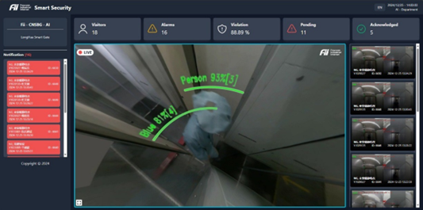 

Figure 1. Normal behavior

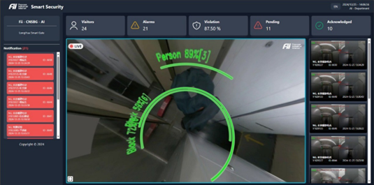

Figure 2. Normal behavior

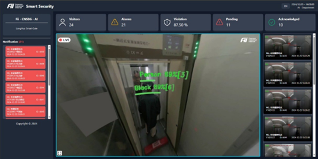

Figure 3. Normal behavior

**2. **A few photos of NG detection:
------------------------------------

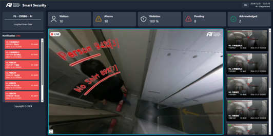

Figure 4.  Anormal behavior -- No shirt

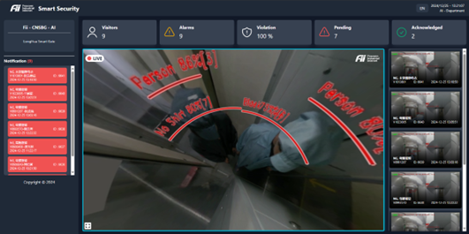

Figure 5.  Anormal behavior -- Multi people

**3. **NG video review photos for confirm actions
-------------------------------------------------

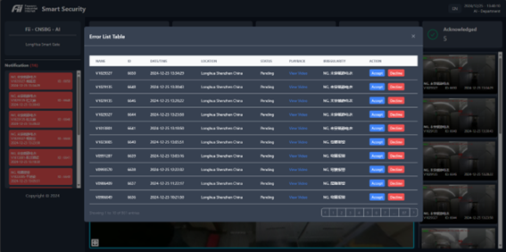

Figure 6.  Anormal behavior -- log

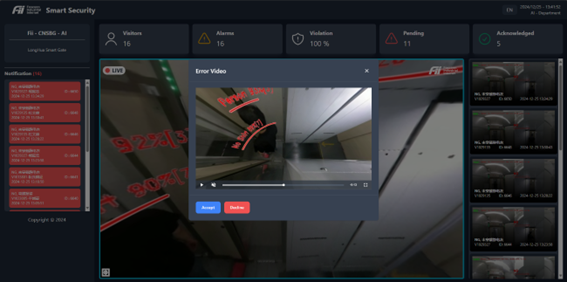

Figure 7.  Anormal behavior -- review

PART 2: TECHNICAL SOLUTIONS
===========================

**4. **Main Technologies Applied:
---------------------------------

### 4.1.  Hardware System Description

#### 4.1.1. Camera 360 specification

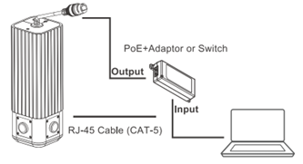

Figure 8.  Foxconn camera  360 and basic connection

| **Product specification** | |
| ------------------------- | -------|
| ISP                       | ASPEED ASTI 235 + ASTI 220 |
| Sensor                    | High quality imaging with 8 MP resolution 1/1.8" CMOS x 4 |
| Stitching                 | Realtime multiple camera image stitching and dewarping |
| Field Of View             | 360° (Horizontal) / 180° (Vertical) / F2.2 |
| Network Interface         | IEEE802.3 10/100/1000 Ethernet |
| Network Protocol          | DHCPC/DNS/NTP/HTTP/HTTPS/IPv4/TCP/UDP RTP/RTSP/RTMP/ONVIF (Profile S) |
| Video compression         | H.264 / MJPEG / H.265 |
| Image enhancement         | WDR, ROI |
| Multichannel Streaming    | 3840x1920 @ 30fps |
| PoE                       | IEEE 802.3at Type 2 |
| Weatherproof              | IP66 |
| Regulatory                | CB ver3 ; CNS15936; ICES-003, Issue 7, Class A; 47 CFR Part15, Subpart B, Class A; 1EC62368-1; 62368-1 ED.2 |
| Humidity                  | 5% to 90% RFI |
| Operation temperature     | \- 10°C to + 50°C |
| Mounting                  | Ceiling / Wall mount |
| Dimension                 | 68 x 68 x 200mm |
| Input Rating              | 48Vdc / 0.5A |

#### 4.1.2. Hardware Connections

The Cam360 -- Smartgate System integrates several hardware components to facilitate seamless operation at a security checkpoint. The following outlines the hypothesized configuration of the hardware setup:

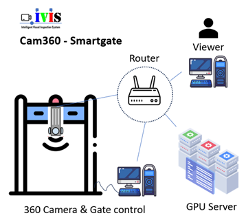

Figure 8.  Hardware setup

#### 4.1.3. 360° Camera

-   **Functionality:** The primary sensor that captures a panoramic view of the checkpoint area in 4K resolution.
-   **Placement:** Mounted on the ceiling at a side, center of the passageway and  to ensure optimal coverage of the checkpoint area.

#### 4.1.4. Processing Unit

-   **Purpose:** Responsible for running AI algorithms for object detection and action recognition.
-   **Specifications:** Equipped with high-performance GPUs, adequate memory, and storage to handle real-time 4K video processing.
-   **Form Factor:** Typically rack-mounted or housed in a secure enclosure near the checkpoint.

#### 4.1.5. Network Infrastructure

-   **Network Switch:** Connects the camera, processing unit, and other system components for efficient communication.
-   **Connectivity:** Enables video streams, data transfer, and API communication over a high-speed network.

#### 4.1.6. Security Hardware

-   **Components:**

-   Physical barriers like turnstiles or doors.
-   Sensors for detecting specific access criteria, such as static electricity equipment or metallic objects.
-   Thiết bị nhận dạng khuôn mặt

-   **Integration:** Communicates with the processing unit via RS232 protocol to execute access decisions (e.g., opening or locking the door).

#### 4.1.7. RS232 Communication

-   **RS232 Port:** Used for serial communication between the processing unit and security hardware.
-   **Adapter Requirement:** Since modern processing units often lack RS232 ports, a USB-to-RS232 converter is typically employed.

#### 4.1.8. Display System

-   **Monitor:** Displays the live video feed from the 360° camera with AI-processed overlays, such as bounding boxes and detected behaviors.
-   **Location:** Positioned where security personnel can monitor events in real time.

#### 4.1.9. Additional Components

-   **Power Supply:** Ensures uninterrupted operation of the system, potentially with backup power for critical components.
-   **Cooling System:** Prevents overheating of the processing unit and other heat-sensitive hardware.
-   **Enclosures and Mounts:** Protect hardware components from environmental factors and ensure proper alignment.

### 4.2.  Workflow

1.  The **360° camera** captures live video and sends the feed to the **processing unit** over the network.
2.  The **processing unit** analyzes the video in real time using AI algorithms to detect objects and behaviors.
3.  Based on the detection results, the **RS232 communication module** sends control signals to the **security hardware** (e.g., opening or locking the door).
4.  Processed video feeds with AI annotations are streamed to a **monitor** for manual oversight and saved to logs.

### 4.3.  AI and Computer Vision Algorithms Deployed

The Cam360 -- Smartgate System leverages several advanced AI and computer vision algorithms to enable real-time monitoring, access control, and security breach detection at checkpoints. Below are the primary algorithms and their functionalities:

#### 4.3.1. Object Detection

-   **Purpose:** Identifies individuals within the camera's field of view.
-   **Algorithm:** Utilizes **Ultralytics YOLO (You Only Look Once)** for high-speed, accurate detection.
-   **Functionality:**

-   Detects and tracks people in real time.
-   Defines bounding boxes around detected individuals for further analysis.

#### 4.3.2. Action Recognition

-   **Purpose:** Monitors specific behaviors that could indicate a security breach.
-   **Likely Technique:** Pose estimation algorithms for identifying key body joint positions.
-   **Functionality:**

-   Detects actions such as bending (classified as NG).
-   Monitors walking patterns to ensure compliance (e.g., single-file movement).
-   Tracks deviations in typical movement patterns for anomaly detection.

#### 4.3.3. Colour Classification

-   **Purpose:** Ensures compliance with uniform or dress code requirements.
-   **Algorithm:** Analyses the color of clothing within detected bounding boxes.
-   **Functionality:**

-   Extracts pixel data to identify clothing colors.
-   Compares detected colors (e.g., blue and black as "OK") against a predefined acceptable range.
-   Flags non-compliance for security intervention.

#### 4.3.4. People Counting

-   **Purpose:** Monitors the number of individuals in a defined area to ensure safe and controlled access.
-   **Technique:** Extends object detection capabilities to count individuals.
-   **Functionality:**

-   Tracks the number of detected people within a specific zone.
-   Triggers alerts if occupancy exceeds pre-set thresholds (e.g., more than one person detected in a restricted passage).

**Integration of Algorithms**

The combination of these algorithms enables the Cam360 system to provide robust and multi-layered security:

1.  **Object detection** forms the foundation, identifying individuals and enabling further analysis.
2.  **Action recognition** enhances behavioral monitoring, ensuring security protocols are upheld.
3.  **Colour classification** adds a layer of compliance monitoring.
4.  **People counting** ensures that the checkpoint adheres to access control limits.

This integrated approach ensures comprehensive security and access control, while maintaining high accuracy and real-time responsiveness.

### 4.4.  Database, Backend, and Frontend Overview

The Cam360 -- Smartgate System integrates robust database, backend, and frontend components to achieve efficient and real-time access control and monitoring at security checkpoints. Below is an overview of each component:

#### 4.4.1. Database

The database serves as the foundation for storing and managing all system data, ensuring easy access and retrieval for analysis and reporting.

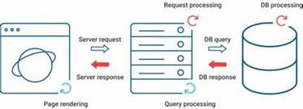

Figure 10. DB structure

-   **Technology:**\
    The system employs an SQL database, such as SQLite, selected for its simplicity and efficiency in handling the anticipated data volume and performance requirements.
-   **Data Storage:**

-   **Events:**

Logs details for each detected event, including time, detected actions, clothing colors, and the number of individuals.

-   **System Logs:**

Stores information about operational status, such as errors, warnings, and overall system health.

-   **Notifications:**

Tracks notifications sent to the frontend, creating a historical record of alerts and communications.

-   **Statistical Summaries:**

Stores performance metrics such as the total number of detected events, detection accuracy, and system uptime.

#### 4.4.2. Backend

The backend is the processing engine of the system, managing video streams, executing AI algorithms, and coordinating system interactions.

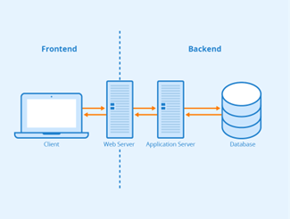

Figure 11. Backend structure

- **Core Functionalities:**

**o ****Video Processing:**

Handles the RTSP video stream from the 360° camera using a dedicated thread for uninterrupted real-time analysis.

-   **Object Detection and Prediction:**

Continuously executes the YOLOv8 object detection algorithm to identify individuals and objects without disrupting the video feed.

-   **Action and Color Recognition:**

Analyzes detected objects to identify actions (e.g., bending) and classify clothing colors against predefined compliance criteria.

-   **People Counting:**

Monitors the number of individuals in the frame, triggering alerts when the count exceeds threshold values.

-   **RS232 Communication:**

Establishes serial communication with security hardware, such as turnstiles or doors, to regulate access based on AI analysis.

-   **Frontend Interaction:**

Provides a REST API for the frontend, enabling data queries, updates, and notification display.

#### 4.4.3. Frontend

The frontend provides an intuitive interface for security personnel to monitor, analyze, and interact with the system.

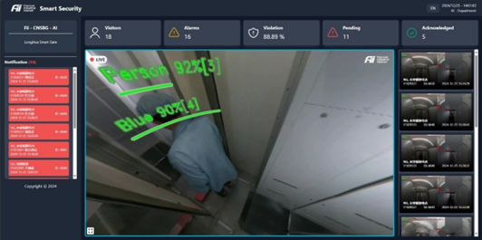

Figure 12. UI

- **Key Features:**

o Live Video Feed:

- Displays the 360° video stream with AI overlays, including bounding boxes, action labels, and alerts.

- Supports panoramic transformation to a 3D viewer for enhanced visualization.

o Event Log:

Presents a detailed log of detected events, including timestamps, locations, event types, and associated actions.

o System Status Dashboard:

Displays metrics such as CPU and memory usage, network connectivity, and the status of connected hardware.

o Notifications:

Shows alerts and security breach notifications in real time, enabling prompt response.

o Configuration Settings:

Allows adjustment of system parameters, such as detection sensitivity, alert triggers, and access control settings.

#### 4.4.4. Interaction Between Components

The system components work together seamlessly to provide an automated and efficient access control solution:

1.  **Video Capture:**

The 360° camera captures real-time video streams and sends them to the backend via RTSP.

1.  **Processing and Detection:**

The backend processes the stream, employing AI algorithms for object detection, action recognition, and clothing color identification.

1.  **Data Storage:**

Event data and system logs are stored in the database for historical analysis and reporting.

1.  **Access Control:**

The backend communicates with security hardware through RS232, triggering actions like unlocking or locking the gate based on analysis results.

1.  **Notifications:**

Alerts are sent to the frontend, notifying personnel of potential security breaches.

1.  **Monitoring and Control:**

The frontend displays the video feed, events, notifications, and system status, allowing personnel to oversee and adjust system operations.

**5. **Details of Processing Workflow of the Cam360 -- Smartgate System:
-----------------------------------------------------------------------

The system follows a structured processing workflow, combining high-resolution imaging, real-time AI analysis, and integration with security hardware for effective access control. Below is a breakdown of each step, along with technical details, algorithms, and a schematic representation.

 
Figure 13. System diagram, including BE, FE and hardware

### 5.1. Image Acquisition from Camera

**Hardware Components and Protocols:**

-   **Camera:**

-   A 360° camera with 4K resolution captures the entire checkpoint area.
-   Features such as real-time stitching and dewarping ensure a panoramic view with minimal blind spots.

-   **RTSP Streaming:**

-   The camera streams video continuously to the backend over RTSP (Real-Time Streaming Protocol), suitable for handling high-quality real-time media.

-   **GStreamer Framework:**

-   The backend uses GStreamer for efficient processing of the RTSP stream.
-   GStreamer provides a pipeline-based architecture, allowing the seamless decoding and preprocessing of the video feed before analysis.

### 5.2. Image Processing and Analysis

**Multithreaded Processing:**

-   A dedicated thread processes video frames to maintain real-time analysis while other threads handle data storage, RS232 communication, and frontend updates.

**Key Algorithms:**

1.  **Object Detection (YOLOv8):**

-   **Overview:** YOLOv8 is employed for its speed and accuracy in detecting people within frames.
-   **Process:**

-   The video frame is divided into a grid, with each grid cell predicting bounding boxes and class probabilities.
-   The model is trained on a labeled dataset to recognize individuals in varied poses and environments.

-   **Output:** Bounding boxes with classification labels for detected individuals.

3.  **Pose Estimation:**

-   **Purpose:** Identifies key body points to infer actions.
-   **Output:**

-   Tracks body movements to detect specific actions like bending or walking patterns, which can indicate security breaches.

5.  **Colour Classification:**

-   **Steps:**

-   **Bounding Box Extraction:** Extracts regions around detected individuals.
-   **Pixel Analysis:** Analyzes the color distribution within the bounding box.
-   **Comparison:** Matches detected colors against predefined acceptable ranges (e.g., blue and black as "OK").

-   **Output:** Flags individuals with restricted clothing colors.

7.  **People Counting:**

-   **Purpose:** Ensures occupancy limits are respected within designated areas.
-   **Method:** Counts the number of bounding boxes within a specific zone.
-   **Trigger:** If the count exceeds a predefined threshold, an alert is generated.

### 5.3. OK/NG Decision Making

**Rule-Based Logic:**

-   The system applies configurable rules to decide if the scenario is compliant ("OK") or non-compliant ("NG").
-   **Examples of Rules:**

-   **People Count Exceeded:** More than one person in a restricted area triggers "NG."
-   **Clothing Color Violation:** Non-compliance with acceptable color codes results in "NG."
-   **Prohibited Actions:** Actions like bending or throwing objects in sensitive zones are flagged as "NG."

**Decision Process:**

-   The backend consolidates outputs from object detection, pose estimation, color classification, and people counting.
-   Based on predefined rules, it generates an OK/NG decision to guide subsequent actions.

### 5.4. Door Control and Data Storage

1. **RS232 Communication:**

o Sends OK/NG signals to security hardware (automated doors).

o **OK Decision:** Unlocks the door or allows access.

o **NG Decision:** Locks the door, triggers alarms, or activates additional security protocols.

2. **Data Storage:**

o **SQL Database:**

- **Event Logs:** Detailed records, including timestamps, event types, and OK/NG statuses.

- **System Logs:** Operational status, errors, and performance metrics.

- **Notifications:** Alerts sent to the frontend.

3. **Frontend Updates:**

o Real-time notifications and status updates are sent to the frontend.

o **Visual Feedback:** Displays live annotated video feeds with bounding boxes, action labels, and alerts.

### 5.5. Workflow Diagram

1. **360° Camera:** Captures video and streams via RTSP → **Backend (GStreamer):** Processes stream.

2. **Object Detection (YOLOv8):** Identifies people and bounding boxes.

3. **Pose Estimation:** Analyzes movements and actions.

4. **Colour Classification:** Detects and verifies clothing compliance.

5. **People Counting:** Ensures adherence to occupancy limits.

6. **Rule-Based Logic:** Applies security rules to decide OK/NG status.

7. **RS232 Communication:** Controls door hardware based on decisions.

8. **Data Storage:** Logs events, notifications, and system health.

9. **Frontend UI:** Displays live feeds, logs, and notifications for monitoring.

PART 3: CHALLENGES AND SOLUTIONS:
=================================

**1. **Technical Challenges
---------------------------

### 1.1. Accuracy in Clothing Recognition

-   **Challenge:**\
    The system achieves 98% accuracy for trained scenarios. However, it struggles with edge cases where clothing closely resembles the approved colors (e.g., blue or black) but is not compliant due to design or texture. The AI model currently relies solely on shape and color, which leads to misclassification when both factors align (e.g., matching design and color but similaring or differing fabric types).
-   **Proposed Solution:**

-   Expanding labeled data to include subtle distinctions in clothing styles or textures.
-   Adjusting the labeled regions to emphasize unique features that differentiate compliant and non-compliant clothing.
-   Incorporating additional input features (e.g., fabric reflectivity or texture analysis) to distinguish similar designs or colors.

-   **Limitation:**\
    The system cannot fully differentiate between identical colors and designs with different fabric types.

### 1.2. Lighting Conditions

-   **Challenge:**\
    Inconsistent lighting in the checkpoint passage (e.g., shadowy areas, glare, or dim light) adversely affects image quality, reducing detection accuracy and leading to false positives or negatives.
-   **Proposed Solutions:**

1.  **Physical Lighting Improvements:**

-   Installing additional light sources to improve illumination uniformity.
-   Adjusting light placement to reduce glare and shadowing, resulting in higher quality raw images.

3.  **Data Collection and Retraining:**

-   Collecting extensive datasets across diverse lighting conditions.
-   Annotating and retraining the model iteratively, with over 20 versions trained to date, gradually improving performance.

### 1.3. Processing Speed and System Latency

-   **Challenge:**\
    The system operates with a single GPU, which must handle high-resolution video processing and complex algorithms such as object detection, pose estimation, and color classification. This constraint leads to slower processing speeds and delays in decision-making.
-   **Proposed Solutions:**

1.  **Algorithm Optimization:**

-   Streamlining the detection pipeline to remove computational bottlenecks.
-   Replacing slower algorithms with simplified alternatives that maintain acceptable accuracy.

3.  **Model Selection Trade-Off:**

-   Selecting lighter models that offer faster inference times, even at a slight cost to detection accuracy (within acceptable tolerances).
-   Balancing the trade-off between speed and accuracy to ensure real-time system responsiveness.

**2. **Solutions Implemented
----------------------------

### 2.1. Data Collection and Expansion

**Data Acquisition:**

-   Collecting real-world data from diverse scenarios to improve model generalization.
-   Scenarios include:

-   Different lighting conditions (e.g., natural light, shadows, low light).
-   Variations in clothing styles, colors, and movements.
-   Edge cases, such as overlapping objects or partially obscured individuals.

**Annotation and Iterative Training:**

-   Carefully annotating data to ensure high-quality labels for training.
-   Training the model iteratively with over 20 versions to gradually refine accuracy and address previously undetected scenarios.
-   Testing each version against real-world conditions to identify weaknesses and improve model robustness.

### 2.2. System Adaptation Using Data

**Internal Data Coverage:**

-   Leveraging internal data collected from the deployment site to ensure comprehensive coverage of possible edge cases.
-   Incorporating data from multiple environments and operational conditions to build a diverse dataset.

**Continuous Model Updating:**

-   Regularly updating the model with newly acquired data to adapt to evolving scenarios.
-   Testing updates in a controlled environment to verify performance improvements before full deployment.

### 2.3. Algorithm Improvement

-   **Training Data Enhancement:**

-   Incorporating a diverse dataset with various lighting conditions, clothing colors, and edge cases.
-   Applying data augmentation techniques, such as adjusting brightness, contrast, and color saturation, to simulate real-world variations.

-   **Focus on Robustness:**

-   Fine-tuning YOLOv8's training for challenging scenarios, such as overlapping colors and objects in motion.
-   Exploring advanced algorithms for color classification that can accommodate subtle lighting shifts.

### 2.4. System Configuration Adjustments

-   **Threshold Calibration:**

-   Adjusting algorithm thresholds for specific environmental conditions to reduce false positives or negatives.
-   Configuring OK/NG decision parameters based on the operational context (e.g., stricter criteria for critical zones).

PART 4: RESULTS ACHIEVED
========================

**1. ****Accuracy in Recognition**
----------------------------------

-   The system achieves an impressive **98% accuracy** in detecting and classifying objects, actions, and clothing colors. This exceeds the initial project requirements outlined in the Esign document (requirements 96%), demonstrating exceptional reliability and precision in recognition tasks.

**2. ****Processing Speed**
---------------------------

-   The system operates at a **processing speed of 25 FPS ****(Frames Per Second)****,** ensuring seamless real-time monitoring. This performance confirms the system's capability to analyze high-resolution video streams and make decisions promptly to meet the demands of access control scenarios.

**3. ****Error Rate**
---------------------

-   The **error rate is 2%**, primarily due to edge cases involving blue and black clothing that match the color and style of company uniforms. These cases remain challenging as the system cannot differentiate based on fabric type, though efforts have been made to minimize such occurrences.

**4. ****User Feedback**
------------------------

-   Users have expressed **high satisfaction** with the system, highlighting its superior quality compared to similar products from competitors like Vizzo.
-   The system has consistently met all operational requirements over an extended period of real-world testing, further reinforcing its reliability and effectiveness.

PART 5: POTENTIAL FOR EXPANDED APPLICATIONS
===========================================

The success of the Cam360 -- Smartgate System demonstrates its potential for broader applications across various industrial and operational contexts. By leveraging its core capabilities---object detection, action recognition, and integration with security hardware---the system can address diverse challenges in automation, security, and safety.

**1. ****Security Control in Industrial Zones**
-----------------------------------------------

-   **Application:**

-   Monitoring entry and exit points, perimeters, and restricted areas.
-   Detecting unauthorized access, tracking individuals, and identifying suspicious behaviors.

-   **Impact:**

-   Enhanced security to prevent theft, vandalism, and other breaches.

**2. ****Production Process Monitoring**
----------------------------------------

-   **Application:**

-   Tracking the movement of personnel and equipment within production areas.
-   Monitoring workflows for compliance with standard operating procedures.

-   **Impact:**

-   Identifying inefficiencies, bottlenecks, and safety risks to improve overall productivity.

**3. ****Automated Quality Control**
------------------------------------

-   **Application:**

-   Utilizing image analysis for defect detection and product inspection.
-   Recognizing patterns, colors, or anomalies to streamline quality checks.

-   **Impact:**

-   Reduced reliance on manual inspection and improved product consistency.

**4. ****Occupational Safety Monitoring**
-----------------------------------------

-   **Application:**

-   Ensuring adherence to safety protocols, such as wearing PPE and maintaining safe distances.
-   Detecting unsafe behaviors, such as bending in restricted zones or improper handling of equipment.

-   **Impact:**

-   Promoting a safer work environment and reducing workplace incidents.

**\
**

**PART 6: OPTIMIZATION PLAN**
=============================

A well-structured optimization plan ensures continuous enhancement of the system's performance and adaptability to future needs.

**1. **Short-Term Optimization
------------------------------

### 1.1. Image Processing Algorithm Optimization

-   **Goal:**

-   Improve the accuracy of detection in diverse environments and edge cases.

-   **Actions:**

-   Refine YOLOv8 with additional training data.
-   Explore newer models such as YOLOv10, YOLOv12... for enhanced performance.
-   Integrate advanced color classification methods for better handling of lighting variations.

### 1.2. User Interface Improvement

-   **Goal:**

-   Make the system more intuitive and efficient for end users.

-   **Actions:**

-   Revamp the UI with customizable dashboards and clearer visualizations.
-   Implement easy-to-navigate controls and streamlined data presentation.

### 1.3. Processing Speed Enhancement

-   **Goal:**

-   Reduce latency to ensure seamless real-time operation.

-   **Actions:**

-   Optimize system code and fine-tune configurations.
-   Explore lightweight algorithms to balance speed and accuracy.

**2. **Long-Term Optimization
-----------------------------

### 2.1. Feature Expansion

-   **Goal:**

-   Adapt the system to evolving needs and applications.

-   **Actions:**

-   Introduce features like sleep behavior recognition, crowd density analysis, and anomaly detection.
-   Add integration with time and attendance systems for workforce management.

### 2.2. Integration of New Technologies

-   **Goal:**

-   Maintain competitiveness by leveraging emerging advancements.

-   **Actions:**

-   Incorporate vision agents and large language models (LLMs) for enhanced decision-making.
-   Utilize edge computing to reduce backend load and enable localized processing.
-   Explore cloud-based solutions for scalable data storage and analytics.

### 2.3. Mobile Version Development

-   **Goal:**

-   Extend accessibility and usability across platforms.

-   **Actions:**

-   Develop mobile-friendly versions of the UI for remote monitoring and management.
-   Enable real-time alerts and updates via mobile devices.

**\
**

**Conclusion**
==============

The successful implementation of the **Cam360 -- Smartgate System** marks a significant milestone in advancing automated access control and monitoring technologies. The system has demonstrated exceptional performance, achieving a high accuracy rate of 98%, real-time processing at 25 FPS, and low error rates under real-world testing conditions. Positive user feedback has highlighted its superiority over competing solutions, fulfilling all operational requirements while maintaining reliability and stability.

The project's outcomes underscore its potential for wide-ranging applications, including enhanced security in industrial zones, production process monitoring, automated quality control, and occupational safety oversight. These use cases highlight the system's adaptability and scalability in addressing diverse operational challenges.

To ensure continuous improvement and relevance, a structured optimization plan has been developed. Short-term goals focus on refining algorithms, enhancing user interfaces, and improving processing speed, while long-term objectives aim to expand features, integrate advanced technologies such as large language models (LLMs) and vision agents, and develop mobile-friendly capabilities.

The **Cam360 -- Smartgate System** is a testament to innovative engineering and effective collaboration. Its success lays the foundation for future projects, driving advancements in AI-powered automation and security solutions across various industries.