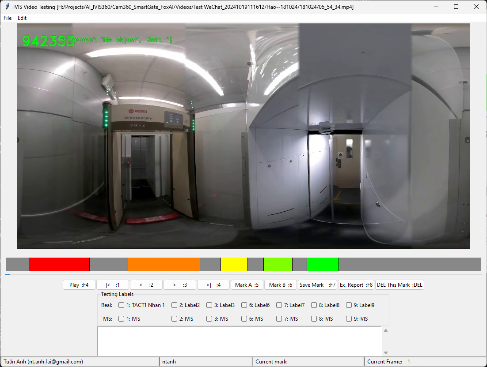

# Các nội dung quan trọng

- [RTSP_Server_from_videos](https://ntanhfai.github.io/RTSP_Server_from_videos/)

## 1. Make_Iso_folders

### Giới thiệu:

Chương trình tạo toàn bộ các folder của thư mục này thành file ISO tự động Chương trình sẽ tự download các file cần thiết về rồi sẽ tạo file create_iso.bat, chạy file bat đó để tạo file iso

Download [tại đây](https://github.com/ntanhfai/Make_Iso_folders/releases)

## Tools for Deeplearning

### Hướng dẫn chung

Các chương trình của Tuấn Anh hầu hết có thể chạy trong Command Line, lệnh help mặc định sẽ là `ntanh`, gõ trực tiếp trong CMD nó sẽ hiển thị hướng dẫn.

### ntanh:
  - ntanh là một thư viện các nhiệm vụ hàng ngày sử dụng, hay dùng nhưng không khó, mất thời gian code cho các dự án lẻ tẻ.
    - CMD: `ntanh`: Help
    - `ParamsBase`: dùng trong Python để lưu tham số.
    - CMD: `ntanh_aug`: Image Augmentation: 
    - CMD: `ntanh_img_del`: Image dupplicate remover
    - CMD: `ntanh_img_resize`: Việc này giúp thay đổi kích thước ảnh về tỷ lệ lý tưởng cho việc huấn luyện mô hình.
    - CMD: `ntanh_delete_files_extention`:
    - `ntanh_delete_files_dupplicates`: Viết chương trình lọc bỏ ảnh trùng nhau theo nội dung
        - Tối Ưu Hóa Qua Phân Cụm Dựa Trên Đặc Trưng (Feature Clustering)
        - Thay vì hash và SSIM, có thể sử dụng các đặc trưng (features) dựa trên đặc điểm cục bộ của ảnh để phân nhóm các ảnh tương tự. Với OpenCV:
            - ORB (Oriented FAST and Rotated BRIEF): Phương pháp này giúp phát hiện và mô tả các đặc trưng quan trọng trong ảnh, không bị ảnh hưởng nhiều bởi thay đổi góc nhìn.
            - K-means clustering hoặc các thuật toán phân cụm khác để gom các ảnh có đặc trưng giống nhau lại và giữ lại các ảnh đại diện.
        - Điều này sẽ giúp giảm thiểu các ảnh gần giống nhau nhưng vẫn đảm bảo đa dạng hóa góc nhìn của đối tượng trong tập huấn luyện.
    - `ntanh_img_resize`: Resize folder images: Việc này giúp thay đổi kích thước ảnh về tỷ lệ lý tưởng cho việc huấn luyện mô hình.
    - 
  - Hướng dẫn và cài đặt tại đây: [https://pypi.org/project/ntanh](https://pypi.org/project/ntanh)
  - Cài nhanh: `pip install ntanh`

### AI_yolo_label_checker:
  - Chương trình này để kiểm tra yolo label
  - Hướng dẫn và cài đặt tại đây: [https://pypi.org/project/AI-yolo-label-checker](https://pypi.org/project/AI-yolo-label-checker)
  - Cài nhanh: `pip install AI-yolo-label-checker`
  - Chạy chương trình: mở Command tại thư mục cần check, gõ lệnh `AI_check` hoặc `AI_yolo_label_checker`
  
### FoxLabel
  - Chương trình đánh nhãn cho Object Detection nhanh, thông minh, đa dụng. Hướng dẫn sử dụng phần mềm sẽ được in lên CMD khi chạy Foxlabel.
  - Hướng dẫn và cài đặt tại đây: [https://pypi.org/project/FoxLabel](https://pypi.org/project/FoxLabel)
  - Install:  `pip install FoxLabel`
  - Chạy chương trình: `FoxLabel` hoặc `ntanh_foxlabel`

## Tính năng
Các tools hỗ trợ tăng tốc độ và độ chính xác của dự án AI Vision: Các tools hỗ trợ tăng tốc độ và độ chính xác của dự án AI Vision:

### 1. [Done] Đánh nhãn ảnh nhanh FoxLabel

    Cách dùng [CMD]: `FoxLabel`

### 2. [Done] Augmentation ảnh

    Cách dùng: [CMD] `ntanh_aug`

### 3. [Done] Xóa ảnh giống nhau trong DB

    Cách dùng: [CMD]: `ntanh_img_del`

### 4. [Done] Thư viện ntanh

Bao gồm: 
- `tactParametters`: BaseParams dung cho lưu cấu hình
- `fnFIS`: Quét toàn bộ các file có đuôi xác định trong thư mục
- `ta_print_log`: Lưu thông tin vào log và in ra màn hình, có đầy đủ đặc tính của lệnh print.
- `get_Home_Dir`: lấy thư mục gốc của kho ứng dung để lưu cấu hình, thư mục này độc lập với thư mục code.

Cách dùng:
  
```python
from ntanh.ParamsBase import tactParametters
APP_NAME='TACT_Main'
class Parameters(tactParametters):
    def __init__(self, ModuleName="TACT"):
        super().__init__(saveParam_onlyThis_APP_NAME=False)
        self.AppName = APP_NAME
        # self.Ready_to_run = False # Nếu bắt buộc phải config thì đặt cái này = False, khi nào user chỉnh sang True thì mới cho chạy
        self.HD = {
            "Mô tả": "Chương trình này nhằm xây dựng tham số cho các chương trình khác",            
        }         
        self.load_then_save_to_yaml(file_path=f"{APP_NAME}.yml", ModuleName=ModuleName)
        # ===================================================================================================
        self.in_var=1
mParams = Parameters("TACT_Module")
mDir="."
mParams.fnFIS(mDir=mDir, exts=("*.jpg", "*.png"))
mParams.ta_print_log("hello")
mParams.get_Home_Dir()

from ntanh import ParamsBase
Parameters.get_Home_Dir(AppName='IVIS_Cam360')
```

### 5. [Done] Convert Yolo to bbox to Yolo

Cách dùng: 
  
```Python
from ntanh.yolo_boxes import xyxy_to_yolo_str, yolo_str_to_xyxy
class img:
  shape = (600, 800, 3)

x1 = 50
y1 = 100
x2 = 200
y2 = 300
imH, imW = img.shape[:2]
obj_class = 0

yolo_str = xyxy_to_yolo_str(obj_class, x1, y1, x2, y2, imH, imW)
print(yolo_str)  # "0 0.156250 0.333333 0.187500 0.333333"

# yolo_str = "0 0.195312 0.416667 0.234375 0.416667"
yolo_str = "0 0.156250 0.333333 0.187500 0.333333"
imH, imW = img.shape[:2]

obj_class, x1, y1, x2, y2 = yolo_str_to_xyxy(yolo_str, imH, imW)
print(obj_class, x1, y1, x2, y2)  # 0 62 125 249 375

```

### 6. [TODO] Yolo Cam360 Projection label checking

Kiểm tra đánh nhãn ảnh cho Cam360 khi chiếu lên hình cầu, nhằm đảm bảo đánh nhãn không bị lỗi.

### 7. [Done] Phần mềm Test kết quả cho IVIS, ảnh 2D

Khi User test xong, phần mềm sẽ lưu kết quả test vào video, chúng ta sẽ dùng video này để test lại độ chính xác của phần mềm IVIS.
Phần mềm này sẽ 
- Mở được video, 
- (Lọc bỏ các ảnh giống nhau, tùy chọn, để giảm dung lượng video cho mục đích lưu trữ và truy xuất nhanh hơn): TODO
- Đánh dấu các vị trí có người qua lại, 
- Đánh dấu nhãn của IVIS và nhãn thực tế
- Xuất báo cáo test cho thư mục test.
- Tải về từ https://drive.google.com/drive/folders/18OAGVkjDYoRwkxnuOa4_vKVmho1nUsif?usp=drive_link 


### 8. [TODO] Chuẩn hóa thư viện UI

### 9. [TODO] Lưu lại video + predicted label của dự án Longhua, phục vụ Re-training

### 10. [TODO]


