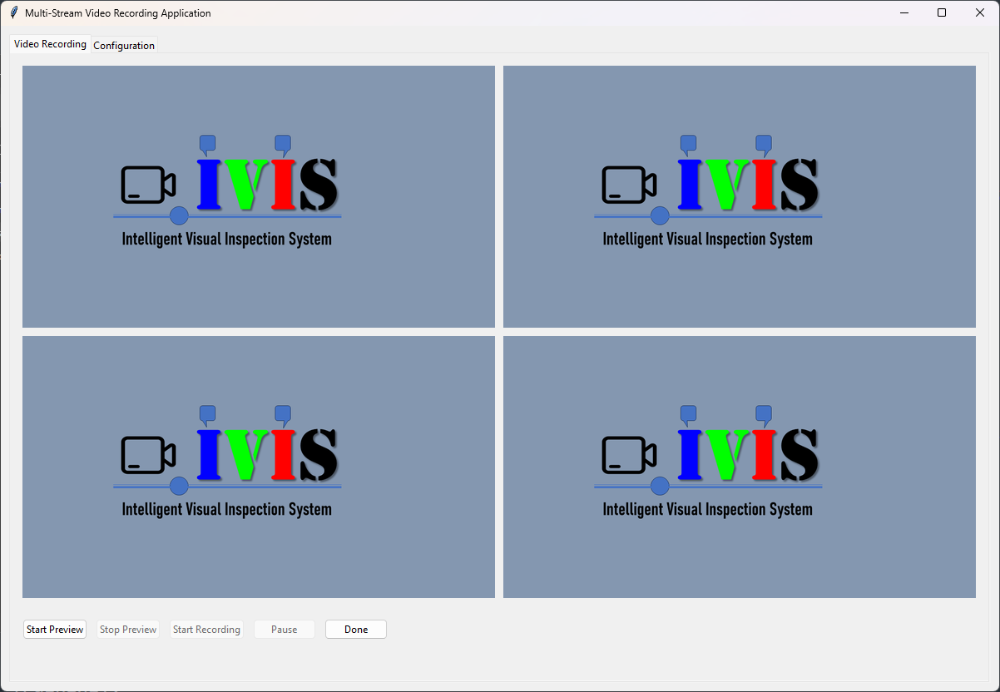
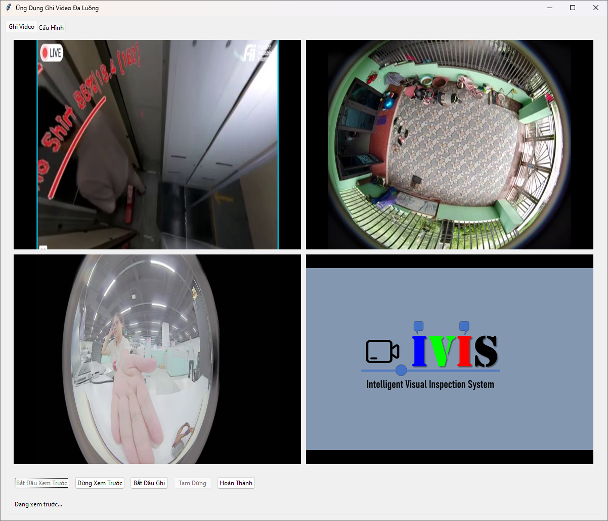

# **RTSPs Video Recorder - Phần mềm quản lý và ghi hình RTSP chuyên nghiệp**

**Giới thiệu:**

RTSPs Video Recorder là một phần mềm chuyên dụng, được thiết kế để quản lý và ghi hình từ nhiều luồng video RTSP một cách hiệu quả. Phần mềm này phù hợp cho các ứng dụng giám sát an ninh, theo dõi sản xuất, và các nhu cầu ghi hình khác, nơi cần xử lý đồng thời nhiều camera IP. Với giao diện thân thiện, khả năng tùy chỉnh cao và tích hợp các công cụ điều khiển chi tiết, RTSPs Video Recorder mang lại sự tiện lợi và linh hoạt cho người dùng.

---






---

**Tính năng nổi bật:**

1. **Hỗ trợ nhiều luồng RTSP**: Cho phép nhập danh sách N luồng video RTSP để quản lý đồng thời nhiều camera.

2. **Ghi hình độc lập từng camera**: 
   - Mỗi camera có điều khiển riêng biệt, bao gồm các nút bắt đầu, tạm dừng, tiếp tục và hoàn tất ghi hình. (TODO)
   - Hiển thị trạng thái ghi hình, số lượng frame đã lưu, thời gian đã chạy và thời gian còn lại.

3. **Lưu video tự động**: 
   - Ghi hình và lưu file video với tên được định dạng tự động dựa trên tên luồng RTSP và thời gian ngày tháng.
   - Tự động chọn định dạng nén video chuẩn (MP4) để tối ưu dung lượng.

4. **Hiển thị video trực tiếp**:
   - Hiển thị luồng video của từng camera ngay trên giao diện chính, hỗ trợ theo dõi trạng thái thực tế.

5. **Tùy chỉnh thời gian ghi hình và thư mục đầu ra**:
   - Dễ dàng thiết lập thời gian ghi tối đa cho từng phiên.
   - Cho phép chọn thư mục lưu trữ video thông qua giao diện.

6. **Lưu cấu hình YAML**: 
   - Lưu trữ và tự động tải lại cấu hình RTSP, thời gian ghi, và thư mục đầu ra mỗi khi mở lại phần mềm.

7. **Thân thiện với người dùng**:
   - Giao diện trực quan với các tab riêng biệt: cấu hình và hiển thị chính.
   - Dễ dàng thao tác và quản lý cả với người dùng không chuyên.

---

**Lợi ích:**

- **Tiết kiệm thời gian**: Quản lý nhiều camera cùng lúc mà không cần phần mềm phức tạp.
- **Đảm bảo hiệu quả**: Hiển thị video và thông tin chi tiết giúp giám sát hoạt động ghi hình một cách chính xác.
- **Tính ứng dụng cao**: Phù hợp cho nhiều lĩnh vực, từ an ninh, sản xuất đến giảng dạy hoặc nghiên cứu.

RTSPs Video Recorder là công cụ lý tưởng cho những ai đang tìm kiếm một giải pháp ghi hình đa camera ổn định, hiệu quả và dễ sử dụng. Với tính năng mạnh mẽ và khả năng tùy chỉnh linh hoạt, phần mềm này hứa hẹn đáp ứng tốt các yêu cầu giám sát và quản lý hình ảnh của bạn.

---
# Download và cài đặt

Tải về từ đây: [Gdrive download] (https://drive.google.com/file/d/1gpN7hs3-TtU4AFCoNMDFNBzCHz_uYXGm/view?usp=sharing)

Giải nén ra, chạy, thay đổi link rtsp, lưu cấu hình, khởi động lại chương trình.

---

# Version 2

Dưới đây là phiên bản cập nhật của chương trình, trong đó:

1. **Thêm một ô nhập (text box) để hiển thị và chỉnh sửa thư mục đầu ra**.
2. **Lưu các thông tin cấu hình (RTSP links, thời gian tối đa, thư mục đầu ra) vào một file YAML**.
3. **Tự động tải các thông tin đã lưu từ file YAML khi chương trình khởi động**.

### Code:

```python
import tkinter as tk
from tkinter import ttk, filedialog, messagebox
from threading import Thread
import cv2
import os
import time
from datetime import datetime
import yaml

CONFIG_FILE = "config.yaml"

class VideoRecorderApp:
    def __init__(self, root):
        self.root = root
        self.root.title("RTSP Video Recorder")
        self.setup_ui()

        self.output_folder = ""
        self.streams = []
        self.capture_threads = []
        self.running = False
        self.paused = False
        self.start_time = None
        self.max_duration = 0
        self.frames_counters = {}

        self.load_config()

    def setup_ui(self):
        # Main Notebook
        self.notebook = ttk.Notebook(self.root)
        self.notebook.pack(expand=1, fill="both")

        # Configuration Tab
        self.config_tab = ttk.Frame(self.notebook)
        self.notebook.add(self.config_tab, text="Cấu hình")

        # Configuration Elements
        ttk.Label(self.config_tab, text="Danh sách RTSP (1 link mỗi dòng):").pack(anchor="w", padx=10, pady=5)
        self.rtsp_text = tk.Text(self.config_tab, height=10)
        self.rtsp_text.pack(fill="both", padx=10, pady=5)

        ttk.Label(self.config_tab, text="Thời gian ghi tối đa (giây):").pack(anchor="w", padx=10, pady=5)
        self.duration_var = tk.StringVar()
        ttk.Entry(self.config_tab, textvariable=self.duration_var).pack(fill="x", padx=10, pady=5)

        ttk.Label(self.config_tab, text="Thư mục đầu ra:").pack(anchor="w", padx=10, pady=5)
        self.output_folder_var = tk.StringVar()
        output_folder_frame = ttk.Frame(self.config_tab)
        output_folder_frame.pack(fill="x", padx=10, pady=5)
        ttk.Entry(output_folder_frame, textvariable=self.output_folder_var).pack(side="left", expand=1, fill="x")
        ttk.Button(output_folder_frame, text="Chọn...", command=self.select_output_folder).pack(side="left", padx=5)

        ttk.Button(self.config_tab, text="Lưu cấu hình", command=self.save_config).pack(pady=10)

        # Main Tab
        self.main_tab = ttk.Frame(self.notebook)
        self.notebook.add(self.main_tab, text="Giao diện chính")

        # Main Interface Elements
        self.stream_frames = tk.Frame(self.main_tab)
        self.stream_frames.pack(expand=1, fill="both")

        self.controls_frame = ttk.Frame(self.main_tab)
        self.controls_frame.pack(fill="x", pady=10)

        self.start_button = ttk.Button(self.controls_frame, text="Bắt đầu ghi", command=self.start_recording)
        self.start_button.pack(side="left", padx=5)

        self.pause_button = ttk.Button(self.controls_frame, text="Tạm dừng ghi", command=self.toggle_pause)
        self.pause_button.pack(side="left", padx=5)

        self.finish_button = ttk.Button(self.controls_frame, text="Hoàn thành", command=self.finish_recording)
        self.finish_button.pack(side="left", padx=5)

    def select_output_folder(self):
        folder = filedialog.askdirectory()
        if folder:
            self.output_folder_var.set(folder)
            self.output_folder = folder

    def save_config(self):
        config = {
            "rtsp_links": self.rtsp_text.get("1.0", tk.END).strip().split("\n"),
            "max_duration": self.duration_var.get(),
            "output_folder": self.output_folder_var.get()
        }
        with open(CONFIG_FILE, "w") as file:
            yaml.dump(config, file)
        messagebox.showinfo("Thông báo", "Cấu hình đã được lưu.")

    def load_config(self):
        if os.path.exists(CONFIG_FILE):
            with open(CONFIG_FILE, "r") as file:
                config = yaml.safe_load(file)
            if config:
                rtsp_links = config.get("rtsp_links", [])
                self.rtsp_text.insert("1.0", "\n".join(rtsp_links))
                self.duration_var.set(config.get("max_duration", ""))
                self.output_folder_var.set(config.get("output_folder", ""))
                self.output_folder = config.get("output_folder", "")

    def start_recording(self):
        if self.running:
            messagebox.showwarning("Cảnh báo", "Đang ghi hình. Hoàn thành trước khi bắt đầu lại.")
            return

        # Get RTSP links and max duration
        self.streams = self.rtsp_text.get("1.0", tk.END).strip().split("\n")
        if not self.output_folder_var.get():
            messagebox.showerror("Lỗi", "Vui lòng chọn thư mục đầu ra!")
            return

        try:
            self.max_duration = int(self.duration_var.get())
        except ValueError:
            messagebox.showerror("Lỗi", "Thời gian ghi tối đa phải là số nguyên!")
            return

        self.running = True
        self.paused = False
        self.frames_counters = {stream: 0 for stream in self.streams}
        self.start_time = time.time()

        # Create preview panels
        for widget in self.stream_frames.winfo_children():
            widget.destroy()

        for i, stream in enumerate(self.streams):
            frame = ttk.Frame(self.stream_frames)
            frame.pack(side="left", expand=1, fill="both", padx=5, pady=5)
            label = ttk.Label(frame, text=f"Stream {i + 1}")
            label.pack()
            canvas = tk.Canvas(frame, width=320, height=240, bg="black")
            canvas.pack()
            self.frames_counters[stream] = {
                "canvas": canvas,
                "frame_count": 0,
                "start_time": time.time(),
            }

        # Start capture threads
        self.capture_threads = []
        for stream in self.streams:
            thread = Thread(target=self.record_stream, args=(stream,))
            thread.start()
            self.capture_threads.append(thread)

    def record_stream(self, stream):
        cap = cv2.VideoCapture(stream)
        if not cap.isOpened():
            messagebox.showerror("Lỗi", f"Không thể mở luồng: {stream}")
            return

        stream_name = stream.split("/")[-1] if "/" in stream else stream
        fourcc = cv2.VideoWriter_fourcc(*"mp4v")
        video_file = os.path.join(
            self.output_folder,
            f"{stream_name}_{datetime.now().strftime('%Y%m%d_%H%M%S')}.mp4",
        )
        out = cv2.VideoWriter(video_file, fourcc, 20.0, (640, 480))

        while self.running and (time.time() - self.start_time < self.max_duration):
            if self.paused:
                time.sleep(0.1)
                continue

            ret, frame = cap.read()
            if not ret:
                break

            out.write(frame)
            self.frames_counters[stream]["frame_count"] += 1

        cap.release()
        out.release()

    def toggle_pause(self):
        if not self.running:
            return

        self.paused = not self.paused
        self.pause_button.config(text="Tiếp tục ghi" if self.paused else "Tạm dừng ghi")

    def finish_recording(self):
        self.running = False
        for thread in self.capture_threads:
            thread.join()
        self.capture_threads = []
        messagebox.showinfo("Thông báo", "Đã hoàn thành ghi hình.")

if __name__ == "__main__":
    root = tk.Tk()
    app = VideoRecorderApp(root)
    root.mainloop()
```

### Điểm cập nhật:
1. **Hiển thị thư mục đầu ra**: Có thể xem và chỉnh sửa đường dẫn trực tiếp trong ô nhập.
2. **Lưu/YAML**: Lưu cấu hình vào file `config.yaml` và tự động nạp lại khi khởi động.
3. **Tính năng ổn định**: Bổ sung kiểm tra lỗi khi không nhập đủ thông tin.

# Version 1

Dưới đây là chương trình sử dụng `tkinter` và `ttk` để xây dựng giao diện và quản lý chức năng ghi hình từ các luồng RTSP. Chương trình chia thành hai tab: cấu hình và giao diện chính, với các chức năng được mô tả:

### Code:

```python
import tkinter as tk
from tkinter import ttk, filedialog, messagebox
from threading import Thread
import cv2
import os
import time
from datetime import datetime

class VideoRecorderApp:
    def __init__(self, root):
        self.root = root
        self.root.title("RTSP Video Recorder")
        self.setup_ui()

        self.output_folder = ""
        self.streams = []
        self.capture_threads = []
        self.running = False
        self.paused = False
        self.start_time = None
        self.max_duration = 0
        self.frames_counters = {}

    def setup_ui(self):
        # Main Notebook
        self.notebook = ttk.Notebook(self.root)
        self.notebook.pack(expand=1, fill="both")

        # Configuration Tab
        self.config_tab = ttk.Frame(self.notebook)
        self.notebook.add(self.config_tab, text="Cấu hình")

        # Configuration Elements
        ttk.Label(self.config_tab, text="Danh sách RTSP (1 link mỗi dòng):").pack(anchor="w", padx=10, pady=5)
        self.rtsp_text = tk.Text(self.config_tab, height=10)
        self.rtsp_text.pack(fill="both", padx=10, pady=5)

        ttk.Label(self.config_tab, text="Thời gian ghi tối đa (giây):").pack(anchor="w", padx=10, pady=5)
        self.duration_var = tk.StringVar()
        ttk.Entry(self.config_tab, textvariable=self.duration_var).pack(fill="x", padx=10, pady=5)

        ttk.Button(self.config_tab, text="Chọn thư mục đầu ra", command=self.select_output_folder).pack(pady=10)

        # Main Tab
        self.main_tab = ttk.Frame(self.notebook)
        self.notebook.add(self.main_tab, text="Giao diện chính")

        # Main Interface Elements
        self.stream_frames = tk.Frame(self.main_tab)
        self.stream_frames.pack(expand=1, fill="both")

        self.controls_frame = ttk.Frame(self.main_tab)
        self.controls_frame.pack(fill="x", pady=10)

        self.start_button = ttk.Button(self.controls_frame, text="Bắt đầu ghi", command=self.start_recording)
        self.start_button.pack(side="left", padx=5)

        self.pause_button = ttk.Button(self.controls_frame, text="Tạm dừng ghi", command=self.toggle_pause)
        self.pause_button.pack(side="left", padx=5)

        self.finish_button = ttk.Button(self.controls_frame, text="Hoàn thành", command=self.finish_recording)
        self.finish_button.pack(side="left", padx=5)

    def select_output_folder(self):
        folder = filedialog.askdirectory()
        if folder:
            self.output_folder = folder
            messagebox.showinfo("Thông báo", f"Thư mục đầu ra đã chọn: {folder}")

    def start_recording(self):
        if self.running:
            messagebox.showwarning("Cảnh báo", "Đang ghi hình. Hoàn thành trước khi bắt đầu lại.")
            return

        # Get RTSP links and max duration
        self.streams = self.rtsp_text.get("1.0", tk.END).strip().split("\n")
        if not self.output_folder:
            messagebox.showerror("Lỗi", "Vui lòng chọn thư mục đầu ra!")
            return

        try:
            self.max_duration = int(self.duration_var.get())
        except ValueError:
            messagebox.showerror("Lỗi", "Thời gian ghi tối đa phải là số nguyên!")
            return

        self.running = True
        self.paused = False
        self.frames_counters = {stream: 0 for stream in self.streams}
        self.start_time = time.time()

        # Create preview panels
        for widget in self.stream_frames.winfo_children():
            widget.destroy()

        for i, stream in enumerate(self.streams):
            frame = ttk.Frame(self.stream_frames)
            frame.pack(side="left", expand=1, fill="both", padx=5, pady=5)
            label = ttk.Label(frame, text=f"Stream {i + 1}")
            label.pack()
            canvas = tk.Canvas(frame, width=320, height=240, bg="black")
            canvas.pack()
            self.frames_counters[stream] = {
                "canvas": canvas,
                "frame_count": 0,
                "start_time": time.time(),
            }

        # Start capture threads
        self.capture_threads = []
        for stream in self.streams:
            thread = Thread(target=self.record_stream, args=(stream,))
            thread.start()
            self.capture_threads.append(thread)

    def record_stream(self, stream):
        cap = cv2.VideoCapture(stream)
        if not cap.isOpened():
            messagebox.showerror("Lỗi", f"Không thể mở luồng: {stream}")
            return

        stream_name = stream.split("/")[-1] if "/" in stream else stream
        fourcc = cv2.VideoWriter_fourcc(*"mp4v")
        video_file = os.path.join(
            self.output_folder,
            f"{stream_name}_{datetime.now().strftime('%Y%m%d_%H%M%S')}.mp4",
        )
        out = cv2.VideoWriter(video_file, fourcc, 20.0, (640, 480))

        while self.running and (time.time() - self.start_time < self.max_duration):
            if self.paused:
                time.sleep(0.1)
                continue

            ret, frame = cap.read()
            if not ret:
                break

            out.write(frame)
            self.frames_counters[stream]["frame_count"] += 1

            # Update preview
            frame_rgb = cv2.cvtColor(frame, cv2.COLOR_BGR2RGB)
            frame_img = cv2.resize(frame_rgb, (320, 240))
            frame_img = tk.PhotoImage(image=tk.BitmapImage(data=cv2.imencode('.ppm', frame_img)[1].tobytes()))
            self.frames_counters[stream]["canvas"].create_image(0, 0, anchor="nw", image=frame_img)

        cap.release()
        out.release()

    def toggle_pause(self):
        if not self.running:
            return

        self.paused = not self.paused
        self.pause_button.config(text="Tiếp tục ghi" if self.paused else "Tạm dừng ghi")

    def finish_recording(self):
        self.running = False
        for thread in self.capture_threads:
            thread.join()
        self.capture_threads = []
        messagebox.showinfo("Thông báo", "Đã hoàn thành ghi hình.")

if __name__ == "__main__":
    root = tk.Tk()
    app = VideoRecorderApp(root)
    root.mainloop()
```

### Hướng dẫn sử dụng:
1. **Nhập danh sách RTSP**: Nhập mỗi đường dẫn RTSP trên một dòng.
2. **Thời gian ghi tối đa**: Nhập thời gian ghi hình tối đa bằng giây.
3. **Chọn thư mục đầu ra**: Chọn nơi lưu các tệp video.
4. **Bắt đầu ghi**: Nhấn nút để bắt đầu.
5. **Tạm dừng/tiếp tục ghi**: Dùng nút để tạm dừng hoặc tiếp tục.
6. **Hoàn thành**: Nhấn nút để dừng toàn bộ và lưu các tệp. 

Mỗi stream sẽ hiển thị khung hình trên giao diện chính và tự động lưu file với tên phù hợp.

# Bộ phát video lên rtsp 

ở đây: `H:\Projects\AI_IVIS360\RTSP_Server\mediamtx_rtsp_server_muliple_video.bat`

```bat
@echo off
rem Khởi động MediaMTX
start "" "G:\Projects\AI_IVIS360\Cam360_SmartGate_FoxAI\IVIS_Data\mediamtx_v1.8.5_windows_amd64\mediamtx.exe"

rem Chờ vài giây để MediaMTX khởi động
timeout /t 5 /nobreak >nul

rem Chạy FFmpeg cho luồng 1
@REM start "" ffmpeg -re -i "G:/video1.mp4" -c:v libx264 -preset veryfast -maxrate 800k -bufsize 1600k -vf "scale=720:360" -g 50 -c:a aac -ar 44100 -f rtsp rtsp://localhost:8554/live1.sdp
start "" ffmpeg -re -i "G:/cam360.mp4" -c:v libx264 -preset veryfast -maxrate 800k -bufsize 1600k -vf "scale=720:360" -g 50  -f rtsp rtsp://localhost:8554/live1

rem Chạy FFmpeg cho luồng 2
start "" ffmpeg -re -i "G:/cam360.avi" -c:v libx264 -preset veryfast -maxrate 800k -bufsize 1600k -vf "scale=640:360" -g 50  -f rtsp rtsp://localhost:8554/live2

@REM rem Chạy FFmpeg cho luồng 3
@REM start "" ffmpeg -re -i "G:/video3.mp4" -c:v libx264 -preset veryfast -maxrate 800k -bufsize 1600k -vf "scale=720:360" -g 50 -c:a aac -ar 44100 -f rtsp rtsp://localhost:8554/live3.sdp

```